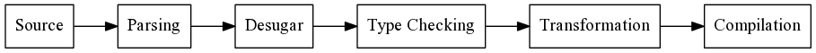
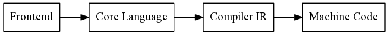

<div class="pagetitle">

</div>

<p class="halfbreak">
</p>

<!--
> *When the limestone of imperative programming is worn away, the granite of
> functional programming will be observed.*
> 
> <cite>— Simon Peyton Jones</cite>

<p class="halfbreak">
</p>
-->

Introduction
============

Goals
-----

Off we go on our Adventure in Haskell Compilers! It will be intense, long,
informative, and hopefully fun.

It's important to stress several points about the goals before we start our
discussion:

a) This is not a rigorous introduction to type systems, it is a series of
informal discussions of topics structured around a reference implementation with
links provided to more complete and rigorous resources on the topic at hand. The
goal is to give you an overview of the concepts and terminology as well as a
simple reference implementation to play around with.

b) None of the reference implementations are industrial strength, many of them
gloss over fundamental issues that are left out for simplicity reasons. Writing
an industrial strength programming language involves work on the order of
hundreds of person-years and is an enormous engineering effort.

c) You should not use the reference compiler for anything serious. It is
intended for study and reference only.

Throughout our discussion we will stress the importance of semantics and the
construction of core calculi.  The frontend language syntax will be in the
ML-family syntax out of convenience rather than principle. Choice of lexical
syntax is arbitrary, uninteresting, and quite often distracts from actual
substance in comparative language discussion. If there is one central theme it
is that the *design of the core calculus should drive development*, not the
frontend language.

Prerequisites
-------------

An intermediate understanding at the level of the *Real World Haskell* book is
recommended.  We will shy away from advanced type-level programming that is
often present in modern Haskell and will make heavy use of more value-level
constructs.  Although a strong familiarity with monads, monad transformers,
applicatives, and the standard Haskell data structures is strongly recommended.

Some familiarity with the standard 3rd party libraries will be useful. Many of
these are briefly overviewed in [What I Wish I Knew When Learning
Haskell](http://dev.stephendiehl.com/hask/).

In particular we will use:

* ``containers``
* ``unordered-containers``
* ``text``
* ``mtl``
* ``filepath``
* ``directory``
* ``process``
* ``parsec``
* ``pretty``
* ``wl-pprint``
* ``graphscc``
* ``haskeline``
* ``repline``
* ``cereal``
* ``deepseq``
* ``uniqueid``
* ``pretty-show``
* ``uniplate``
* ``optparse-applicative``
* ``unbound-generics``
* ``language-c-quote``
* ``bytestring``
* ``hoopl``
* ``fgl``
* ``llvm-general``
* ``smtLib``
* ``sbv``

In later chapters some experience with C, LLVM and x86 Assembly will be very
useful, although not strictly required.

Concepts
========

We are going to set out to build a *statically typed* *functional* programming
language with a *native code generation* *backend*. What does all this mean?

Functional Languages
--------------------

In mathematics a *function* is defined as a correspondence that assigns exactly
one element of a set to each element in another set.  If a function $f(x) = a$
then the function evaluated at $x$ will always have the value $a$. Central to
the notion of all mathematics is the notion of *equational reasoning*, where
if $a= f(x)$ then for an expression $g(f(x), f(x))$, this is always equivalent
to $g(a, a)$. In other words the values computed by functions can always be
substituted freely at all occurrences.

The central idea of *functional programming* is to structure our programs in
such a way that we can reason about them as a system of equations just like
we can in mathematics. The evaluation of a pure function is one in which *side
effects* are prohibited, a function may only return a result without altering
the world in any *observable* way.

The implementation may perform effects, but central to this definition is the
unobservability of such effects.  A function is said to be *referentially
transparent* if replacing a function with its computed value output yields the
same observable behavior.

By contrast impure functions are ones which allow unrestricted and observable
side effects. The invocation of an impure function always allows for the
possibility of performing any functionality before yielding a value.

```javascript
// impure: mutation side effects
function f() {
  x += 3;
  return 42;
}

// impure: international side effects
function f() {
  launchMissiles();
  return 42;
}
```

The behavior of a pure function is independent of where and when it is
evaluated, whereas the sequence a impure function is intrinsically tied to its
behavior.

Functional programming is defined simply as programming strictly with pure
referentially transparent functions.

Static Typing
-------------

*Types* are a formal language integrated with a programming language that
refines the space of allowable behavior and degree of expressible programs for
the language.  Types are the world's most popular formal method for analyzing
programs.

In a language like Python all expressions have the same type at compile time,
and all syntactically valid programs can be evaluated. In the case where the
program is nonsensical the runtime will bubble up exceptions at runtime. The
Python interpreter makes no attempt to analyze the given program for soundness
at all before running it.

```bash
>>> True & "false"
Traceback (most recent call last):
  File "<stdin>", line 1, in <module>
TypeError: unsupported operand type(s) for &: 'bool' and 'str'
```

By comparison Haskell will do quite a bit of work to try to ensure that the
program is well-defined before running it. The language that we use to
predescribe and analyze static semantics of the program is that of *static
types*.

```bash
Prelude> True && "false"

<interactive>:2:9:
    Couldn't match expected type `Bool' with actual type `[Char]'
    In the second argument of `(&&)', namely `"false"'
    In the expression: True && "false"
    In an equation for `it': it = True && "false"
```

Catching minor type mismatch errors is the simplest example of usage, although
they occur extremely frequently as we humans are quite fallible in our reasoning
about even the simplest of program constructions! Although this is just the tip
of the iceberg, the gradual trend over the last 20 years goes toward more
*expressive types* in modern type systems which are capable of guaranteeing a
large variety of program correctness properties.

* Preventing resource allocation errors.
* Enforcing security access for program logic.
* Side effect management.
* Preventing buffer overruns.
* Ensuring cryptographic properties for network protocols.
* Modeling and verifying theorems in mathematics and logic.
* Preventing data races and deadlocks in concurrent systems.

Type systems can never capture all possible behavior of the program. Although
more sophisticated type systems are increasingly able to model a large space of
behavior and is one of the most exciting areas of modern computer science
research. Put most bluntly, **static types let you be dumb** and offload the
checking that you would otherwise have to do in your head to a system that can
do the reasoning for you and work with you to interactively build your program.

Functional Compilers
--------------------

A *compiler* is a program for turning high-level representation of ideas in a
human readable language into another form. A compiler is typically divided into
parts, a *frontend* and a *backend*. These are loose terms but the frontend
typically deals with converting the human representation of the code into some
canonicalized form while the backend converts the canonicalized form into
another form that is suitable for evaluation.

The high level structure of our functional compiler is described by the
following *block diagram*. Each describes a *phase* which is a sequence of
transformations composed to transform the input program.



* **Source**            - The frontend textual source language.
* **Parsing**           - Source is parsed into an abstract syntax tree.
* **Desugar**           - Redundant structure from the frontend language is removed and canonicalized.
* **Type Checking**     - The program is type-checked and/or type-inferred yielding an explicitly typed form.
* **Transformation**    - The core language is transformed to prepare for compilation.
* **Compilation**       - The core language is lowered into a form to be compiled or interpreted.
* **(Code Generation)** - Platform specific code is generated, linked into a binary.

A *pass* may transform the input program from one form into another or alter the
internal state of the compiler context. The high level description of the forms
our final compiler will go through is the following sequence:



Internal forms used during compilation are *intermediate representations* and
typically any non-trivial language will involve several.

Parsing
-------

The source code is simply the raw sequence of text that specifies the program.
Lexing splits the text stream into a sequence of *tokens*. Only the presence of
invalid symbols is checked, programs that are meaningless in other ways are
accepted.
Whitespace is either ignored or represented as a unique token in the stream.

```haskell
let f x = x + 1
```

For instance the previous program might generate a token stream like the
following:

```haskell
[
  TokenLet,
  TokenSym "f",
  TokenSym "x",
  TokenEq,
  TokenSym "x",
  TokenAdd,
  TokenNum 1
]
```

We can then scan the token stream via and dispatch on predefined patterns of
tokens called *productions* and recursively build up a datatype for the
*abstract syntax tree* (AST) by traversal of the input stream and generation of
the appropriate syntactic.

```haskell
type Name = String

data Expr
  = Var Name
  | Lit Lit
  | Op PrimOp [Expr]
  | Let Name [Name] Expr

data Lit
  = LitInt Int

data PrimOp
  = Add
```

So for example the following string is parsed into the resulting ``Expr`` value.

```haskell
let f x = x + 1
```

```haskell
Let "f" ["x"] (Op Add [Var "x", Lit (LitInt 1)])
```

Desugaring
----------

Desugaring is the process by which the frontend AST is transformed into a
simpler form of itself by reducing the number of complex structures by
expressing them in terms of a fixed set of simpler constructs.

Haskell's frontend is very large and many constructs are simplified down. For
example ``where`` clauses and operator sections are the most common examples.
Where clauses are effectively syntactic sugar for let bindings and operator
sections are desugared into lambdas with the left or right
hand side argument assigned to a fresh variable.

Type Inference
--------------

Type inference is the process by which the untyped syntax is endowed with type
information by a process known as *type reconstruction* or *type inference*. The
inference process may take into account explicit type annotations.

```haskell
let f x = x + 1
```

```haskell
Let "f" [] (Lam "x" (Op Add [Var "x", Lit (LitInt 1)]))
```

Inference will generate a system of constraints which are solved via a process
known as *unification* to yield the type of the expression.

```haskell
Int -> Int -> Int  ~  a -> b
b  ~  Int -> c
```

```haskell
f :: Int -> Int
```

In some cases this type will be incorporated directly into the AST and the
inference will transform the frontend language into an explicitly typed *core
language*.

```haskell
Let "f" []
  (Lam "x"
    (TArr TInt TInt)
    (App
      (App
        (Prim "primAdd") (Var "x"))
      (Lit (LitInt 1))))
```

Transformation
--------------

The type core representation is often suitable for evaluation, but quite often
different intermediate representations are more amenable to certain
optimizations and make explicit semantic properties of the language explicit.
These kind of intermediate forms will often attach information about free
variables, allocations, and usage information directly onto the AST to make it 

The most important form we will use is called the *Spineless Tagless G-Machine*
( STG ), an abstract machine that makes many of the properties of lazy
evaluation explicit directly in the AST.

Code Generation
---------------

From the core language we will either evaluate it on top of a high-level
interpreter written in Haskell itself, or into another intermediate language
like C or LLVM which can itself be compiled into native code.

```haskell
let f x = x + 1
```

Quite often this process will involve another intermediate representation which
abstracts over the process of assigning and moving values between CPU registers
and main memory. LLVM and GHC's Cmm are two target languages serving this
purpose.

```haskell
f:
  mov res, arg
  add res, 1
  ret
```

```haskell
define i32 @f(i32 %x) {
entry:
  %add = add nsw i32 %x, 1
  ret i32 %add
}
```

From here the target language can be compiled into the system's assembly
language. All code that is required for evaluation is *linked* into the
resulting module.

```perl
f:
        movl    %edi, -4(%rsp)
        movl    -4(%rsp), %edi
        addl    $1, %edi
        movl    %edi, %eax
        ret

```

And ultimately this code will be assembled into platform specific instructions by
the *native code generator*, encoded as a predefined sequence of CPU
instructions defined by the processor specification.

```perl
0000000000000000 <f>:
   0:   89 7c 24 fc             mov    %edi,-0x4(%rsp)
   4:   8b 7c 24 fc             mov    -0x4(%rsp),%edi
   8:   81 c7 01 00 00 00       add    $0x1,%edi
   e:   89 f8                   mov    %edi,%eax
  10:   c3                      retq
```

\pagebreak
