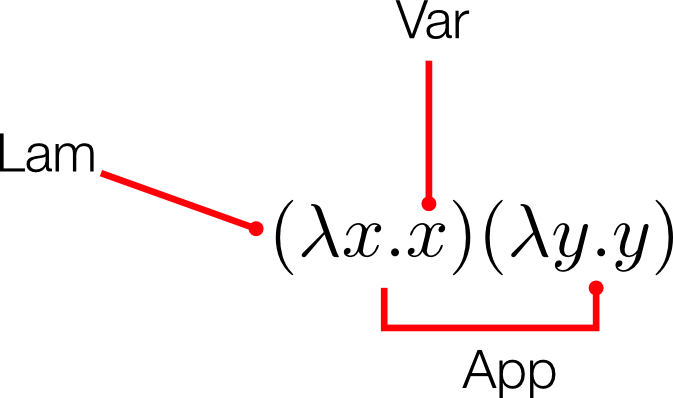

<div class="pagetitle">

</div>

<p class="halfbreak">
</p>

> *That language is an instrument of human reason, and not merely a medium for
> the expression of thought, is a truth generally admitted.*
> 
> <cite>— George Boole</cite>

<p class="halfbreak">
</p>

Lambda Calculus
===============

Fundamental to all functional languages is the most atomic notion of
composition, function abstraction of a single variable.  The **lambda calculus**
consists very simply of three terms and all valid recursive combinations
thereof:

<div class="small">

</div>

These types are typically referred to in code by several contractions of their
names:

- **Var** - A variable
- **Lam** - A lambda abstraction
- **App** - An application

$$
\begin{aligned}
e :=\ & x            & \trule{Var} \\
     & \lambda x. e  & \trule{Lam} \\
     & e\ e          & \trule{App} \\
\end{aligned}
$$

The lambda calculus is often called the "assembly language" of functional
programming, and variations and extensions on it form the basis of many
functional compiler intermediate forms for languages like Haskell, OCaml,
StandardML, etc. The variation we will discuss first is known as **untyped
lambda calculus**, by contrast later we will discuss the **typed lambda
calculus** which is an extension thereof.

A lambda abstraction is said to bind its variable.
For example the lambda here binds $x$.

$$
\lambda x. e
$$

There are several syntactical conventions that we will adopt when writing lambda
expressions. Application of multiple expressions associates to the left.

$$
x_1\ x_2\  x_3\ ... x_n =  (... ((x_1 x_2 )x_3 ) ... x_n )
$$

By convention application extends as far to the right as is syntactically
meaningful. Parenthesis are used to disambiguate.

In the lambda calculus all lambda abstractions bind a single variable, their
body may be another lambda abstraction. Out of convenience we often write
multiple lambda abstractions with their variables on one lambda symbol.
This is merely a syntactical convention and does not change the underlying
meaning.

$$
\lambda xy.z = \lambda x. \lambda y.z
$$

The actual implementation of the lambda calculus admits several degrees of
freedom in how they are represented. The most notable is the choice of
identifier for the binding variables. A variable is said to be *bound* if it is
contained in a lambda expression of the same variable binding. Conversely a
variable is *free* if it is not bound.

A term with free variables is said to be an *open term* while one without free
variables is said to be *closed* or a *combinator*.

$$
\begin{aligned}
e_0 &= \lambda x . x \\
e_1 &= \lambda x. (x (\lambda y. y a) x) y \\
\end{aligned}
$$

$e_0$ is a combinator while $e_1$ is not. In $e_1$ both occurances of $x$ are bound. The first $y$ is bound,
while the second is free. $a$ is also free.

Multiple lambda abstractions may bind the same variable name.
Each occurance of a variable is then bound by the nearest enclosing binder.
For example  the $x$ variable in the following expression is
bound on the inner lambda, while $y$ is bound on the outer lambda. This
phenomenon is referred to as *name shadowing*.

$$
\lambda x y. (\lambda x z. x + y)
$$

SKI Combinators
----------------

There are three fundamental closed expressions called the SKI combinators.

$$
\begin{aligned}
\textbf{S} &= \lambda f .( \lambda g .( \lambda x. f x ( g x ) ) ) \\
\textbf{K} &= \lambda x . \lambda y. x \\
\textbf{I} &= \lambda x.x \\
\end{aligned}
$$

In Haskell these are written simply:

```haskell
s f g x = f x (g x)
k x y = x
i x = x
```

Rather remarkably Moses Schönfinkel showed that all closed lambda expression can be expressed in terms of only the
**S** and **K** combinators - even the **I** combinator. For example one can easily show that **SKK**
reduces to **I**.

$$
\begin{aligned}
&\textbf{S} \textbf{K} \textbf{K}\\
&= ((\lambda xyz.x z (y z)) (\lambda xy.x) (\lambda xy.x)) \\
&= ((\lambda yz.(\lambda xy.x) z (y z)) ( \lambda xy.x)) \\
&= \lambda  z.(\lambda xy.x) z ((\lambda xy.x) z) \\
&= \lambda  z.(\lambda y.z) ((\lambda xy.x) z) \\
&= \lambda  z.z \\
&= \textbf{I}\\
\end{aligned}
$$

This fact is a useful sanity check when testing an implementation of the lambda calculus.

**Omega Combinator**

An important degenerate case that we'll test is the omega combinator which applies a single argument to
itself.

$$
\omega = \lambda x. x x \\
$$

When we apply the $\omega$ combinator to itself we find that this results in an
infinitely long repeating chain of reductions. A sequence of reductions that has
no normal form ( i.e. it reduces indefinitely ) is said to *diverge*.

$$
(\lambda x. x x) (\lambda x. x x) \to \\
  \quad (\lambda x. x x)(\lambda x. x x) \to  \\
  \quad \quad (\lambda x. x x)(\lambda x. x x) \ldots
$$

We'll call this expression the $\Omega$ combinator. It is the canonical looping
term in the lambda calculus. Quite a few of our type systems which are
statically typed will reject this term from being well-formed, so it is quite a
useful tool for testing.

$$
\Omega = \omega \omega = (\lambda x. x x) (\lambda x. x x)\\
$$

Implementation
--------------

The simplest implementation of the lambda calculus syntax with named binders is
the following definition.

```haskell
type Name = String

data Expr
  = Var Name
  | App Expr Expr
  | Lam Name Expr
```

There are several lexical syntax choices for lambda expressions, we will simply
choose the Haskell convention which denotes lambda by the backslash (``\``) to
the body with (``->``), and application by spaces. Named variables are simply
alphanumeric sequences of characters.

* **Logical notation**: $\mathtt{const} = \lambda x y . x$
* **Haskell notation**: ``const = \x y -> x``

In addition other terms like literal numbers or booleans can be added, and these
make writing expository examples a little easier. For these we will add a
``Lit`` constructor.

```haskell
data Expr
  = ...
  | Lit Lit

data Lit
  = LInt Int
  | LBool Bool
```

Substitution
------------

Evaluation of a lambda term ($(\lambda x.e) a$) proceeds by substitution of all
free occurrences of the variable $x$ in $e$ with the argument $a. A single
substitution step is called a *reduction*. We write the substitution application
in brackets before the expression it is to be applied over, $[x / a]e$ maps the
variable $x$ to the new replacement $a$ over the expression $e$.

$$
(\lambda x. e) a \to [x / a] e
$$

A substitution metavariable will be written as $[s]$.

In detail, substitution is defined like this:

$$
\begin{array}{rll}
[x/a] x = & a\\
[x/a] y = & y & \text{if}\ x\neq y\\
[x/a]ee' = & ([x/a]e)([x/a]e')\\
[x/a]\lambda x.e = & \lambda x.e\\
[x/a]\lambda y.e = & \lambda y.[x/a]e & \text{if}\ x \neq y\ \text{and}\ y \notin\FV{e}\\
\end{array}
$$

The fundamental issue with using locally named binders is the problem of *name
capture*, or how to handle the case where a substitution conflicts with the
names of free variables. We need the condition in the last case to avoid the
naive substitution that would fundamentally alter the meaning of the following
expression when $y$ is rewritten to $x$.

$$
[y / x] (\lambda x.xy)  \to  \lambda x.xx
$$

By convention we will always use a *capture-avoiding* substitution.
Substitution will only proceed if the variable is not in the set of free
variables of the expression, and if it does then a fresh variable will be
created in its place.

$$
(\lambda x. e) a \to [x / a] e \quad \text{if}\ x \notin \FV{a}
$$

There are several binding libraries and alternative implementations of the
lambda calculus syntax that avoid these problems. It is a very common problem
and it is very easy to implement incorrectly even for experts.

Conversion and Equivalences
---------------------------

**Alpha equivalence**

$$
(\lambda x.e) \overset{\alpha} = (\lambda y. [x / y] e)
$$

Alpha equivalence is the property ( when using named binders ) that changing the
variable on the binder and throughout the body of the expression should not
change the fundamental meaning of the whole expression. So for example the
following are alpha-equivalent.

$$
\lambda x y.  x y \quad \overset{\alpha} = \quad \lambda a b . a b
$$

**Beta-reduction**

Beta reduction is simply a single substitution step, replacing a variable bound
by a lambda expression with the argument to the lambda throughout the body of
the expression.

$$
(\lambda x.a) y  \overset{\beta}{\rightarrow}  [x / y] a
$$

**Eta-reduction**

$$
\lambda x.ex \overset{\eta}{\rightarrow} e \quad \text{if} \quad x \notin \FV{e}
$$

This is justified by the fact that if we apply both sides to a term,
one step of beta reduction turns the left side to the right side:

$$
(\lambda x.ex)e' \overset{\beta}{\rightarrow} ee' \quad \text{if} \quad x \notin \FV{e}
$$

**Eta-expansion**

The opposite of eta reduction is eta-expansion, which takes a function that is
not saturated and makes all variables explicitly bound in a lambda.
Eta-expansion will be important when we discuss translation into STG.


Reduction
---------

Evaluation of lambda calculus expressions proceeds by beta reduction. The
variables bound in a lambda are substituted across the body of the lambda. There
are several degrees of freedom in the design space about how to do this, and in
which order an expression should be evaluated. For instance we could evaluate
under the lambda and then substitute variables into it, or instead evaluate the
arguments and then substitute and then reduce the lambda expressions. More on
this will be discussed in the section on Evaluation models.

```bash
Untyped> (\x.x) 1
1

Untyped> (\x y . y) 1 2
2

Untyped> (\x y z. x z (y z)) (\x y . x) (\x y . x)
  => \x y z . (x z (y z))
  => \y z . ((\x y . x) z (y z))
    => \x y . x
    => \y . z
   => z
 => \z . z
\z . z
```

In the untyped lambda calculus we can freely represent infinitely diverging
expressions:

```bash
Untyped> \f . (f (\x . (f x x)) (\x . (f x x)))
\f . (f (\x . (f x x)) (\x . (f x x)))

Untyped> (\f . (\x. (f x x)) (\x. (f x x))) (\f x . f f)
...

Untyped> (\x. x x) (\x. x x)
...
```

Let
---

In addition to application, a construct known as a **let binding** is often
added to the lambda calculus syntax. In the untyped lambda calculus, let
bindings are semantically equivalent to applied lambda expressions.

$$
\mathtt{let}\ a = e\ \mathtt{in}\ b \quad := \quad (λa.b) e
$$

In our languages we will write let statements like they appear in Haskell.

```haskell
let a = e in b
```

Toplevel expression will be written as ``let`` statements without a body to
indicate that they are added to the global scope. The Haskell lanuage does
not use this convention but OCaml, StandardML and the interactive mode of the
Haskell compiler GHC do. In Haskell the preceding let is simply
omitted.

```haskell
let S f g x = f x (g x);
let K x y = x;
let I x = x;

let skk = S K K;
```

For now the evaluation rule for let is identical to that of an applied lambda.

$$
\begin{array}{clll}
(\lambda x. e) v     & \rightarrow & [x/v] e                   & \trule{E-Lam} \\
\mathtt{let} \ x = v \ \mathtt{in} \ e & \rightarrow & [x/v] e & \trule{E-Let} \\
\end{array}
$$

In later variations of the lambda calculus let expressions will have different
semantics and will differ from applied lambda expressions. More on this will be
discussed in the section on Hindley-Milner inference.

Recursion
---------

Probably the most famous combinator is Curry's Y combinator. Within an untyped
lambda calculus, Y can be used to allow an expression to contain a reference to
itself and reduce on itself permitting recursion and looping logic.

$$\textbf{Y} = \lambda f.(\lambda x.(f (x x)) \lambda x.(f (x x)))$$

The Y combinator satisfies:

$$\textbf{Y} f  = f (\textbf{Y} f) $$

For fun one can prove that the Y-combinator can be expressed in terms of the S
and K combinators.

$$ \textbf{Y} = \textbf{SSK(S(K(SS(S(SSK))))K)}$$

In a untyped lambda calculus language without explicit fixpoint or recursive let
bindings, the Y combinator can be used to create both of these constructs out of
nothing but lambda expressions. However it is more common to just add either an
atomic fixpoint operator or a recursive let as a fundamental construct in the
term syntax. 

$$
\begin{aligned}
e :=\ & x \\
     & e_1\ e_2 \\
     & \lambda x . e \\
     & \t{fix}\  e \\
\end{aligned}
$$

Where $\t{fix}$ has the evaluation rule:

$$
\begin{array}{cll}
\mathtt{fix} \ v     & \rightarrow & v\ (\mathtt{fix}\ v) \\
\end{array}
$$

Together with the fixpoint (or the Y combinator) we can create let bindings
which contain a reference to itself within the body of the bound expression.
We'll call these *recursive let bindings*, they are written as ``let rec`` in ML
dialects.  For now we will implement recursive lets as simply syntactic sugar
for wrapping a fixpoint around a lambda binding by the following equivalence.

```haskell
let rec x = e1 in e2    =    let x = fix (\x. e1) in e2
```

So for example we can now write down every functional programmer's favorite two
functions: ``factorial`` and ``fibonacci``. To show both styles, one is written
with ``let rec`` and the other with explicit ``fix``.

```ocaml
let fact = fix (\fact -> \n ->
  if (n == 0)
    then 1
    else (n * (fact (n-1))));
```

```haskell
let rec fib n =
  if (n == 0)
  then 0
  else if (n==1)
  then 1
  else ((fib (n-1)) + (fib (n-2)));
```

Pretty Printing
---------------

Hackage provides quite a few pretty printer libraries that ease the process of
dumping out textual forms for our data types. Although there are some
differences between the libraries most of them use the same set of combinators.
We will use the ``Text.PrettyPrint`` module from the
[pretty](https://hackage.haskell.org/package/pretty-1.1.1.1) package on Hackage.
Most of our pretty printing will be unavoidable boilerplate but will make
debugging internal state much easier.

              Combinators
-----------   ------------
``<>``        Concatenation
``<+>``       Spaced concatenation
``char``      Renders a character as a ``Doc``
``text``      Renders a string as a ``Doc``
``hsep``      Horizontally concatenates a list of ``Doc``
``vcat``      Vertically joins a list of ``Doc`` with newlines

The core type of the pretty printer is the ``Doc`` type which is the abstract
type of documents. Combinators over this type will manipulate the internal
structure of this document which is then finally reified to an physical string
using the ``render`` function. Since we intend to pretty print across multiple
types we will create a ``Pretty`` typeclass.

```haskell
module Pretty where

import Text.PrettyPrint

class Pretty p where
  ppr :: Int -> p -> Doc

  pp :: p -> Doc
  pp = ppr 0
```

First, we create two helper functions that collapse our lambda
bindings so we can print them out as single lambda expressions.

```haskell
viewVars :: Expr -> [Name]
viewVars (Lam n a) = n : viewVars a
viewVars _ = []

viewBody :: Expr -> Expr
viewBody (Lam _ a) = viewBody a
viewBody x = x
```

Then we create a helper function for parenthesizing subexpressions.

```haskell
parensIf ::  Bool -> Doc -> Doc
parensIf True = parens
parensIf False = id
```

Finally, we define ``ppr``. The ``p`` variable will indicate our depth
within the current structure we're printing and allow us to print out
differently to disambiguate it from its surroundings if necessary.

```haskell
instance Pretty Expr where
  ppr p e = case e of
    Lit (LInt a)  -> text (show a)
    Lit (LBool b) -> text (show b)
    Var x   -> text x
    App a b -> parensIf (p>0) $ (ppr (p+1) a) <+> (ppr p b)
    Lam x a -> parensIf (p>0) $
         char '\\'
      <> hsep (fmap pp (viewVars e))
      <+> "->"
      <+> ppr (p+1) (viewBody e)

ppexpr :: Expr -> String
ppexpr = render . ppr 0
```

Full Source
-----------

* [Untyped Lambda Calculus](https://github.com/sdiehl/write-you-a-haskell/tree/master/chapter4/untyped)

\pagebreak
