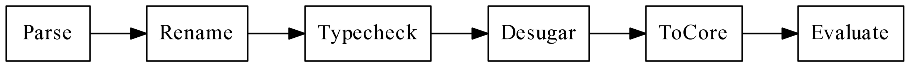
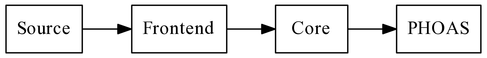

<div class="pagetitle">

</div>

<!--
> Functional languages are unnatural to use. [...] The important question is
> whether functional programming in unnatural the way Haiku is unnatural or the
> way Karate is unnatural. Haiku is a rigid form poetry in which each poem must
> have precisely three lines and seventeen syllables. As with poetry, writing a
> purely functional program often gives one a feeling of great aesthetic pleasure.
> <cite>— James H. Morris, et al</cite>
-->

<p class="halfbreak">
</p>

Design of ProtoHaskell
======================

Now that we've completed our simple little ML language, let's discuss the road
ahead toward building a more complex language we'll call *ProtoHaskell* that
will eventually become the full *Fun* language.

Language        Chapters Description
-------------   -------- --------------------------
*Poly*          1 - 8    Minimal type inferred ML-like language.
*ProtoHaskell*  8 - 18   Interpreted minimal Haskell subset.
*Fun*           18 - 27  ProtoHaskell with native code generator.

The defining feature of ProtoHaskell is that it is independent of an evaluation
model, so hypothetically one could write either a lazy or a strict backend and use
the same frontend.

Before we launch into writing compiler passes let's look at the overview of
where we're going, the scope of what we're going to do, and what needs to be
done to get there. *We will refer to concepts that are not yet introduced, so
keep in mind this is meant to be a high-level overview of the ProtoHaskell
compiler pipeline.*

Haskell: A Rich Language
-----------------------

Haskell itself is a beautifully simple language at its core, although the
implementation of GHC is arguably anything but simple! The more one digs into
the implementation the more it becomes apparent that a lot of care and
forethought was given to making the frontend language as expressive as it is.
Many of these details require a great detail of engineering work to make them
work as seamlessly as they do.

Consider this simple Haskell example but note how much of an extension this is
from our simple little ML interpreter.

```haskell
filter :: (a -> Bool) -> [a] -> [a]
filter pred [] = []
filter pred (x:xs)
  | pred x         = x : filter pred xs
  | otherwise      =     filter pred xs

```

Consider all the things that are going on just in this simple example.

* Lazy evaluation
* Custom datatypes
* Higher order functions
* Parametric polymorphism
* Function definition by pattern matching
* Pattern matching desugaring
* Guards to distinguish sub-cases
* Type signature must subsume inferred type
* List syntactic sugar ( value/pattern syntax )

Clearly we're going to need a much more sophisticated design, and we'll likely
be doing quite a bit more bookkeeping about our program during compilation.

Scope
-----

Considering our project is intended to be a simple toy language, we are not
going to implement all of Haskell 2010. Doing so in its entirety would actually
be a fairly involved effort. However we will implement a sizable chunk of the
functionality, certainly enough to write non-trivial programs and implement most
of the standard Prelude.

Things we will implement:

* Indentation sensitive grammar
* Pattern matching
* Algebraic datatypes
* Where statements
* Recursive functions/datatypes
* Operator sections
* Implicit let-rec
* List and tuple sugar
* Records
* Custom operators
* Do-notation
* Type annotations
* Monadic IO
* Typeclasses
* Arithmetic primops
* Type synonyms
* List comprehensions

Things we will not implement are:

* Overloaded literals
* GADTs
* Polymorphic recursion
* Any GHC-specific language extensions.
* Newtypes
* Module namespaces
* Operator parameters
* Defaulting rules
* Exceptions
* Parallelism
* Software Transactional Memory
* Foreign Function Interface

Now if one feels so inclined one could of course implement these features on top
of our final language, but they are left as an exercise to the reader!

This of course begs the question of whether or not our language is "a Haskell".
In the strictest sense, it will not be since it doesn't fully conform to either
the [Haskell 98](https://www.haskell.org/onlinereport/) or [Haskell
2010](https://www.haskell.org/onlinereport/haskell2010/) language
specifications.  However in terms of the colloquial usage of the term Haskell,
there does seem to be some growing feeling that the "Haskell language family"
does exist as a definable subset of the functional programming design space,
although many people disagree what its defining features are. In this sense we
will most certainly be writing a language in the Haskell family.

Intermediate Forms
------------------

The passes between each of the phases make up the main *compilation pipeline* .





For *ProtoHaskell* our pipeline consists of the transitions between four
intermediate forms of the program.





* The **Source**, the textual representation of the program from a file or user
  input. This is stored in a ``Text`` type.
* The **Frontend** source, the untyped AST generated from the parser.
* The **Core**, the explicitly typed, desugared form of the program generated
  after type inference.
* The **PHOAS**, the type-erased Core is transformed into Haskell expressions
  by mapping lambda expressions in our language directly into Haskell lambda
  expressions and then evaluated using the Haskell runtime.

Pass          Rep         Haskell Type
--------      --------    ---------
Parsing       Source      ``Text.Text``
Desugaring    Frontend    ``Frontend.Expr``
Typechecking  Core        ``Core.Expr``
Evaluation    PHOAS       ``CoreEval.ExprP``


For our later *Fun* language our pipeline builds on top of the *ProtoHaskell*
but instead of going to an interpreter it will be compiled into native code
through the native code generator (on top of LLVM) and compiled into a binary
executable or evaluated by a just-in-time (JIT) compiler.

Pass            Rep         Haskell Type
--------        --------    ---------
Parsing         Source      ``Text.Text``
Desugaring      Frontend    ``Frontend.Expr``
Typechecking    Core        ``Core.Expr``
Transformation  STG         ``STG.Expr``
Transformation  Imp         ``Imp.Expr``
Code Generation LLVM        ``LLVM.General.Module``

Compiler Monad
--------------

The main driver of the compiler will be a ``ExceptT`` + ``State`` + ``IO``
transformer stack . All other passes and transformations in the compiler will
hang off of this monad, which encapsulates the main compilation pipeline.

```haskell
type CompilerMonad =
  ExceptT Msg
    (StateT CompilerState IO)
```

```haskell
data CompilerState = CompilerState
  { _fname    :: Maybe FilePath            -- ^ File path
  , _imports  :: [FilePath]                -- ^ Loaded modules
  , _src      :: Maybe L.Text              -- ^ File source
  , _ast      :: Maybe Syn.Module          -- ^ Frontend AST
  , _tenv     :: Env.Env                   -- ^ Typing environment
  , _kenv     :: Map.Map Name Kind         -- ^ Kind environment
  , _cenv     :: ClassEnv.ClassEnv         -- ^ Typeclass environment
  , _cast     :: Maybe Core.Module         -- ^ Core AST
  , _flags    :: Flags.Flags               -- ^ Compiler flags
  , _venv     :: CoreEval.ValEnv Core.Expr -- ^ Core interpreter environment
  , _denv     :: DataEnv.DataEnv           -- ^ Entity dictionary
  , _clenv    :: ClassEnv.ClassHier        -- ^ Typeclass hierarchy
  } deriving (Eq, Show)
```

The compiler itself will have several entry points, ``expr`` for interactive
evaluation that expects an expression object and joins it into accumulated
interactive environment. And ``modl`` path that compile whole modules.

Throughout the next 10 chapters we will incrementally create a series of
transformations with the following type signatures.

```haskell
parseP   :: FilePath -> L.Text -> CompilerM Syn.Module
dataP    :: Syn.Module -> CompilerM Syn.Module
groupP   :: Syn.Module -> CompilerM Syn.Module
renameP  :: Syn.Module -> CompilerM Syn.Module
desugarP :: Syn.Module -> CompilerM Syn.Module
inferP   :: Syn.Module -> CompilerM Core.Module
evalP    :: Core.Module -> CompilerM ()
```

The code path for ``modl`` is then simply the passes composed with the Kleisli
composition operator to form the composite pipeline for compiling modules.

```haskell
(>=>) :: Monad m => (a -> m b) -> (b -> m c) -> a -> m c
```

And that's basically the entire structure of the compiler. It's just a pipeline
of monadic actions for each pass rolled up inside of ``CompilerM``.

```haskell
modl :: FilePath -> L.Text -> CompilerM ()
modl fname
    = parseP fname
  >=> dataP
  >=> groupP
  >=> renameP
  >=> desugarP
  >=> inferP
  >=> evalP
```

Engineering Overview
====================

REPL
----

It is important to have an interactive shell to be able to interactively explore
the compilation steps and intermediate forms for arbitrary expressions. GHCi
does this very well, and nearly every intermediate form is inspectable. We will
endeavor to recreate this experience with our toy language.

If the ProtoHaskell compiler is invoked either in GHCi or as standalone
executable, you will see a similar interactive shell.

```haskell
 _   _           _       | ProtoHaskell Compiler 0.1.0
| | | | __ _ ___| | __   | Copyright (c) 2013-2015 Stephen Diehl
| |_| |/ _` / __| |/ /   | Released under the MIT License
|  _  | (_| \__ \   <    |
|_| |_|\__,_|___/_|\_\   | Type :help for help

Compiling module: prelude.fun
> id (1+2)
3
> :type (>>=)
(>>=) :: Monad m => m a -> (a -> m b) -> m b
> :set -ddump-rn
> :load test.fun
```

Command line conventions will follow GHCi's naming conventions.  There
will be a strong emphasis on building debugging systems on top of our
architecture so that when subtle bugs creep up you will have the tools to
diagnose the internal state of the type system and detect flaws in the
implementation.

Command           Action
-----------       ------------
``:browse``       Browse the type signatures for a program
``:load <file>``  Load a program from file
``:reload``       Run the active file
``:edit``         Edit the active file in system editor
``:core``         Show the core of an expression or program
``:module``       Show active modules imports
``:source``       Show the source code of an expression or program
``:type``         Show the type of an expression
``:kind``         Show the kind of an expression
``:set <flag>``   Set a flag
``:unset <flag>`` Unset a flag
``:constraints``  Dump the typing constraints for an expression
``:quit``         Exit interpreter

The most notable difference is the very important ``:core`` command which will
dump out the core representation of any expression given in the interactive
shell. Another one is the ``:constraints`` command which will interactively
walk you through the type checker's reasoning about how it derived the type
it did for a given expression.

```haskell
> :type plus
plus :: forall a. Num a => a -> a -> a

> :core id
id :: forall a. a -> a
id = \(ds1 : a) -> a

> :core compose
compose :: forall c d e. (d -> e) -> (c -> d) -> c -> e
compose = \(ds1 : d -> e)
           (ds2 : c -> d)
           (ds3 : c) ->
            (ds1 (ds2 ds3))
```

The flags we use also resemble GHC's and allow dumping out the pretty printed
form of each of the intermediate transformation passes.

* ``-ddump-parsed``
* ``-ddump-desugar``
* ``-ddump-rn``
* ``-ddump-infer``
* ``-ddump-core``
* ``-ddump-types``
* ``-ddump-stg``
* ``-ddump-imp``
* ``-ddump-c``
* ``-ddump-llvm``
* ``-ddump-asm``
* ``-ddump-to-file``


The implementation of the interactive shell will use a custom library called
[repline](http://hackage.haskell.org/package/repline) , which is a higher-level
wrapper on top of ``haskeline`` made to be more pleasant when writing
interactive shells.

Parser
------

We will use the normal Parsec parser with a few extensions. We will add
indentation sensitive parsing so that block syntax ( where statements, let
statements, do-notation ) can be parsed.

```haskell
main :: IO ()
main = do
  putStrLn msg
  where
    msg = "Hello World"
```

We will also need to allow the addition of infix operators from
user-defined declarations, and allow this information to be used during parsing.

```haskell
infixl 6 +
infixl 7 *

f = 1 + 2 * 3
```

Renamer
-------

After parsing we will traverse the entire AST and rename all user-named
variables to machine generated names and eliminate any name-shadowing. For
example in the following ambiguous binder will replace the duplicate occurrence
of ``x`` with a fresh name.

```haskell
f x y = \g x -> x + y    -- x in definition of g shadows x in f
f x y = \g a0 -> a0 + y
```

We will also devise a general method of generating fresh names for each pass
such that the names generated are uniquely relatable to that pass and cannot
conflict with later passes.

Ensuring that all names are unique in the syntax tree will allow us more safety
later on during program transformation, to know that names cannot implicitly
capture and the program can be transformed without changing its meaning.

Datatypes
---------

User defined data declarations need to be handled and added to the typing
context so that their use throughout the program logic can be typechecked. This
will also lead us into the construction of a simple kind inference system, and
the support of higher-kinded types.

```haskell
data Bool = False | True
data Maybe a = Nothing | Just a
data T1 f a = T1 (f a)
```

Each constructor definition will also introduce several constructor functions
into the Core representation of the module. Record types will also be supported
and will expand out into selectors for each of the various fields.

Desugaring
----------

Pattern matching is an extremely important part of a modern functional
programming language, but the implementation of the pattern desugaring is remarkably
subtle. The frontend syntax allows the expression of nested pattern matches and
incomplete patterns, both can generate very complex *splitting trees* of case
expressions that need to be expanded out recursively.

**Multiple Equations**

For instance the following toplevel pattern for the ``xor`` function is
transformed into the following nested set of case statements:

```haskell
-- Frontend
xor False False = False;
xor False True = True;
xor True False = True;
xor True True = False;
```

```haskell
-- Desugared
xor :: Bool -> Bool -> Bool
xor = \_a _b -> case _a of {
                  False -> case _b of {
                             False -> False;
                             True -> True
                           };
                  True -> case _b of {
                            False -> True;
                            True -> False
                          }
                }
```

**Constructor Patterns**

Toplevel declarations in the frontend language can consist of patterns for on
the right-hand-side of the declaration, while in the Core language these are
transformed into case statements in the body of the function.

```haskell
-- Frontend
f (Left  l) = a
f (Right r) = b

-- Desugared
f x = case x of
    Left  l -> a
    Right r -> b
```

**Nested Patterns**

The frontend language also allows nested constructors in a single pattern, while
in the Core language these are expanded out into two case statements which
scrutinize only one level of pattern.

```haskell
-- Frontend
f x = case x of
  Just (Just y) -> y

-- Desugared
f x = case x of
  Just _a -> case _a of
    Just _b -> _b
```

There are many edge cases of pattern matching that we will have to consider.
The confluence of all them gives rise to a rather complex set of AST rewrites:

* Multiple arguments
* Overlapping patterns
* Literal patterns
* Nested patterns
* Non-exhaustive equations
* Conditional equations
* Non-linear patterns

On top of pattern matching we will implement the following more trivial
syntactic sugar translations:

* Expand ``if/then`` statements into case expressions.
* Expand pattern guards into case expressions.
* Expand out do-notation for monads.
* Expand list syntactic sugar.
* Expand tuple syntactic sugar.
* Expand out operator sections.
* Expand out string literals.
* Expand out numeric literals.

We will however punt on an important part of the Haskell specification, namely
*overloaded literals*. In Haskell numeric literals are replaced by specific
functions from the ``Num`` or ``Fractional`` typeclasses.

```haskell
-- Frontend
42 :: Num a => a
3.14 :: Fractional a => a

-- Desugared
fromInteger (42 :: Integer)
fromRational (3.14 :: Rational)
```

We will not implement this, as it drastically expands the desugarer scope.

We will however follow GHC's example in manifesting unboxed types as first
class values in the language so literals that appear in the AST are rewritten
in terms of the wired-in constructors (``Int#``, ``Char#``, ``Addr#``, etc).

```haskell
I# : Int# -> Int
C# : Char# -> Char
```

```haskell
> :core 1
I# 1#
> :core 1 + 2
plus (I# 1#) (I# 2#)
> :core "snazzleberry"
unpackCString# "snazzleberry"#
```

Core
----

The Core language is the result of translation of the frontend language into an
explicitly typed form. Just like GHC we will use a System-F variant,
although unlike GHC we will effectively just be using vanilla System-F without
all of the extensions ( coercions, equalities, roles, etc ) that GHC uses to
implement more complicated features like GADTs and type families.

This is one of the most defining feature of GHC Haskell, its compilation
into a statically typed intermediate Core language. It is a well-engineers
detail of GHC's design that has informed much of how Haskell the language has
evolved as a language with a exceedingly large frontend language that all melts
away into a very tiny concise set of abstractions. Just like GHC we will extract
all our language into a small core, with just a few constructors.

```haskell
data Expr
  = App Expr Expr
  | Var Var
  | Lam Name Type Expr
  | Case Expr [Alt]
  | Let Bind Expr
  | Lit Literal
  | Placeholder Name Type

data Var
  = Id Name Type
  | TyVar Name Kind
```

The types and kind types are also equally small.

```haskell
data Type
  = TVar TVar
  | TCon TyCon
  | TApp Type Type
  | TArr Type Type
  | TForall [Pred] [TVar] Type

data Kind
  = KStar
  | KArr Kind Kind
  | KPrim
  | KVar Name
```

Since the Core language is explicitly typed, it is trivial to implement an
internal type checker for it. Running the typechecker on the generated core is a
good way to catch optimization and desugaring bugs, and determine if the compiler
has produced invalid intermediate code.

<!--
*Core, It's just a simple functional language!*
-->

Type Classes
------------

Typeclasses are also remarkably subtle to implement. We will implement just
single parameter typeclasses and use the usual *dictionary passing translation*
when compiling the frontend to Core. Although the translation and instance
search logic is not terribly complicated, it is however very verbose and
involves a lot of bookkeeping about the global typeclass hierarchy.

For example the following simplified ``Num`` typeclass generates quite a bit of
elaborated definitions in the Core language to generate the dictionary and
selector functions for the overloaded ``plus`` function.

```haskell
class Num a where
  plus :: a -> a -> a
  mult :: a -> a -> a
  sub :: a -> a -> a

instance Num Int where
  plus = plusInt
  mult = multInt
  sub  = subInt

plusInt :: Int -> Int -> Int
plusInt (I# a) (I# b) = I# (plusInt# a b)
```

This expands into the following set of Core definitions.

```haskell
plusInt :: Int -> Int -> Int
plusInt = \(ds1 : Int)
           (ds2 : Int) ->
            case ds1 of {
              I# ds8 ->
                case ds2 of {
                  I# ds9 ->
                    case (plusInt# ds8 ds9) of {
                      __DEFAULT {ds5} -> (I# ds5)
                    }
                }
            }

dplus :: forall a. DNum a -> a -> a -> a
dplus = \(tpl : DNum a) ->
          case tpl of {
            DNum a b c -> a
          }

plus :: forall e. Num e => e -> e -> e
plus = \($dNum_a : DNum e)
     (ds1 : e)
     (ds2 : e) ->
      (dplus $dNum_a ds1 ds2)
```

Our typeclass infrastructure will be able to support the standard typeclass
hierarchy from the Prelude. Our instance search mechanism will be subject to the
same restriction rules that GHC enforces.

* Paterson condition
* Coverage condition
* Bounded context stack

Type Checker
------------

The type checker is the largest module and probably the most nontrivial part of our
compiler. The module consists of roughly 1200 lines of code. Although the logic
is not drastically different from the simple little HM typechecker we wrote
previously, it simply has to do more bookkeeping and handle more cases.

The implementation of the typechecker will be split across four modules:

* ``Infer.hs`` - Main inference driver
* ``Unify.hs`` - Unification logic
* ``ClassEnv.hs`` - Typeclass instance resolution
* ``Elaboration.hs`` - Typeclass elaboration

The monad itself is a ``RWST`` + ``Except`` stack, with State holding the
internal state of the inference engine and Writer gathering the generated
constraint set that is passed off to the solver.

```haskell
-- | Inference monad
type InferM = RWST
   Env             -- Typing environment
   [Constraint]    -- Generated constraints
   InferMState     -- Inference state
     (Except       -- Inference errors
       TypeError)

-- | Inference state
data InferMState = InferMState
  { count     :: Int         -- ^ Name supply
  , preds     :: [Pred]      -- ^ Typeclass predicates
  , skolems   :: Skolems     -- ^ Skolem scope
  , overloads :: ClassEnv    -- ^ Overloaded identifiers
  , active    :: Name        -- ^ Active function name
  , classh    :: ClassHier   -- ^ Typeclass hierarchy
  }
```

In *Fun* we will extend the simple type checker with arbitrary rank polymorphism
(i.e. ``RankNTypes`` in GHC). This is actually required to implement typeclasses
in their full generality, although in *ProtoHaskell* we will cheat a little bit.

Interpreter
-----------

For ProtoHaskell we will actually directly evaluate the resulting Core
expressions in an interpreter. By virtue of us translating the expressions into
Haskell expressions we will get lazy evaluation almost for free and will let us
run our programs from inside of the interactive shell.

```haskell
sieve :: [Int] -> [Int]
sieve [] = []
sieve (p:ps) = p : sieve (filter (nonMultiple p) ps)

nonMultiple :: Int -> Int -> Bool
nonMultiple p n = ((n/p)*p) /= n

primes :: [Int]
primes = sieve [2..]
```

```haskell
ProtoHaskell> take 5 (cycle [1,2])
[1,2,1,2,1]

ProtoHaskell> take 5 primes
[2,3,5,7,11]
```

Error Reporting
---------------

We will do quite a bit of error reporting for the common failure modes of the
type checker, desugar, and rename phases including position information tracking
in Fun.  However doing this in full is surprisingly involved and would add a
significant amount of code to the reference implementation. As such we will not
be as thorough as GHC in handling every failure mode by virtue of the scope of
our project being a toy language with the primary goal being conciseness and
simplicity.

Frontend
========

The Frontend language for ProtoHaskell is a fairly large language, consisting of
many different types. Let's walk through the different constructions. The
frontend syntax is split across several datatypes.

* ``Decls`` - Declarations syntax
* ``Expr``  - Expressions syntax
* ``Lit``   - Literal syntax
* ``Pat``   - Pattern syntax
* ``Types`` - Type syntax
* ``Binds`` - Binders

At the top is the named *Module* and all toplevel declarations contained
therein. The first revision of the compiler has a very simple module structure,
which we will extend later in fun with imports and public interfaces.

```haskell
data Module = Module Name [Decl]         -- ^ module T where { .. }
  deriving (Eq,Show)
```

Declarations or ``Decl`` objects are any construct that can appear at toplevel
of a module. These are namely function, datatype, typeclass, and operator
definitions.

```haskell
data Decl
  = FunDecl BindGroup                    -- ^ f x = x + 1
  | TypeDecl Type                        -- ^ f :: Int -> Int
  | DataDecl Constr [Name] [ConDecl]     -- ^ data T where { ... }
  | ClassDecl [Pred] Name [Name] [Decl]  -- ^ class (P) => T where { ... }
  | InstDecl [Pred] Name Type [Decl]     -- ^ instance (P) => T where { ... }
  | FixityDecl FixitySpec                -- ^ infixl 1  {..}
  deriving (Eq, Show)
```

A binding group is a single line of definition for a function declaration. For
instance the following function has two binding groups.

```haskell
factorial :: Int -> Int

-- Group #1
factorial 0 = 1

-- Group #2
factorial n = n * factorial (n - 1)
```

One of the primary roles of the desugarer is to merge these disjoint binding
groups into a single splitting tree of case statements under a single binding
group.

```haskell
data BindGroup = BindGroup
  { _matchName  :: Name
  , _matchPats  :: [Match]
  , _matchType  :: Maybe Type
  , _matchWhere :: [[Decl]]
  } deriving (Eq, Show)
```

The expression or ``Expr`` type is the core AST type that we will deal with and
transform most frequently. This is effectively a simple untyped lambda calculus
with let statements, pattern matching, literals, type annotations, if/these/else
statements and do-notation.

```haskell
type Constr = Name

data Expr
  = EApp  Expr Expr        -- ^ a b
  | EVar  Name             -- ^ x
  | ELam  Name Expr        -- ^ \\x . y
  | ELit  Literal          -- ^ 1, 'a'
  | ELet  Name Expr Expr   -- ^ let x = y in x
  | EIf   Expr Expr Expr   -- ^ if x then tr else fl
  | ECase Expr [Match]     -- ^ case x of { p -> e; ... }
  | EAnn  Expr Type        -- ^ ( x : Int )
  | EDo  [Stmt]            -- ^ do { ... }
  | EFail                  -- ^ pattern match fail
  deriving (Eq, Show)
```

Inside of case statements will be a distinct pattern matching syntax, this is
used both at the toplevel function declarations and inside of case statements.

```haskell
data Match = Match
  { _matchPat :: [Pattern]
  , _matchBody :: Expr
  , _matchGuard :: [Guard]
  } deriving (Eq, Show)

data Pattern
  = PVar Name              -- ^ x
  | PCon Constr [Pattern]  -- ^ C x y
  | PLit Literal           -- ^ 3
  | PWild                  -- ^ _
  deriving (Eq, Show)
```

The do-notation syntax is written in terms of two constructions, one for monadic
binds and the other for monadic statements.

```haskell
data Stmt
  = Generator Pattern Expr -- ^ pat <- exp
  | Qualifier Expr         -- ^ exp
  deriving (Eq, Show)
```

Literals are the atomic wired-in types that the compiler has knowledge of and
will desugar into the appropriate builtin datatypes.

```haskell
data Literal
  = LitInt Int           -- ^ 1
  | LitChar Char         -- ^ 'a'
  | LitString [Word8]    -- ^ "foo"#
  deriving (Eq, Ord, Show)
```

For data declarations we have two categories of constructor declarations that
can appear in the body, regular constructors and record declarations. We will
adopt the Haskell ``-XGADTSyntax`` for all data declarations.

```haskell
-- Regular Syntax
data Person = Person String Int

-- GADTSyntax
data Person where
  Person :: String -> Int -> Person

-- Record Syntax
data Person where
  Person :: Person { name :: String, age :: Int }
```

```haskell
data ConDecl
  = ConDecl Constr Type                -- ^ T :: a -> T a
  | RecDecl Constr [(Name, Type)] Type -- ^ T :: { label :: a } -> T a
  deriving (Eq, Show, Ord)
```

Fixity declarations are simply a binding between the operator symbol and the
fixity information.

```haskell
data FixitySpec = FixitySpec
  { fixityFix :: Fixity
  , fixityName :: String
  } deriving (Eq, Show)

data Assoc = L | R | N
  deriving (Eq,Ord,Show)

data Fixity
  = Infix Assoc Int
  | Prefix Int
  | Postfix Int
  deriving (Eq,Ord,Show)
```

Data Declarations
-----------------

Data declarations are named blocks of various *ConDecl* constructors for each of
the fields or constructors of a user-defined datatype.

```haskell
data qname [var] where
  [tydecl]
```

```haskell
data Unit where
  Unit :: Unit
```


```haskell
DataDecl
      (Name "Unit")
      []
      [ ConDecl
          (Name "Unit") (Forall [] [] (TCon AlgTyCon { tyId = Name "Unit" }))
      ]
```

Function Declarations
---------------------

Function declarations create *FunDecl* with *BindGroup* for the pattern on the
left hand side of the toplevel declaration. The ``matchPat`` is simply the
sequence of patterns (``PVar``, ``PCon``, ``PLit``) on the left hand side. If a
type annotation is specified it is stored in the ``matchType`` field. Likewise,
if there is a sequence of where statements these are also attached directly to
the declaration, and will later be desugared away into local let statements
across the body of the function.

```haskell
qname [pat] = rhs [where decls]
```

```haskell
const x y = x
```

```haskell
FunDecl
  BindGroup
    { _matchName = Name "const"
    , _matchPats =
        [ Match
            { _matchPat = [ PVar (Name "x") , PVar (Name "y") ]
            , _matchBody = EVar (Name "x")
            }
        ]
    , _matchType = Nothing
    , _matchWhere = [ [] ]
    }
```

Pattern matches across multiple lines are treated as two separate declarations,
which will later be grouped on the ``matchName`` in the desugaring phase. So for
instance the ``map`` function has the following representation:

```haskell
map f [] = []
map f (x:xs) = Cons (f x) (map f xs)
```

```haskell
FunDecl
  BindGroup
    { _matchName = Name "map"
    , _matchPats =
        [ Match
            { _matchPat = [ PVar (Name "f") , PCon (Name "Nil") [] ]
            , _matchBody = EVar (Name "Nil")
            }
        ]
    , _matchType = Nothing
    , _matchWhere = [ [] ]
    }

FunDecl
  BindGroup
    { _matchName = Name "map"
    , _matchPats =
        [ Match
            { _matchPat =
                [ PVar (Name "f")
                , PCon (Name "Cons") [ PVar (Name "x") , PVar (Name "xs") ]
                ]
            , _matchBody =
                EApp
                  (EApp
                     (EVar (Name "Cons")) (EApp (EVar (Name "f")) (EVar (Name "x"))))
                  (EApp
                     (EApp (EVar (Name "map")) (EVar (Name "f"))) (EVar (Name "xs")))
            }
        ]
    , _matchType = Nothing
    , _matchWhere = [ [] ]
    }
```

Fixity Declarations
-------------------

Fixity declarations are exceedingly simple, they store the binding precedence of the
declaration along with its associativity (Left, Right, Non-Associative) and the
infix symbol.

```haskell
[infixl|infixr|infix] [integer] ops;
```

```haskell
infixl 4 +;
```

```haskell
FixityDecl
  FixitySpec { fixityFix = Infix L 4 , fixityName = "+" }
```

Typeclass Declarations
----------------------

Typeclass declarations consist simply of the list of typeclass constraints, the
name of the class, and the type variable ( single parameter only ). The body of
the class is simply a sequence of scoped ``FunDecl`` declarations with only the
``matchType`` field.

```haskell
class [context] => classname [var] where
  [body]
```

Consider a very simplified ``Num`` class.

```haskell
class Num a where
  plus :: a -> a -> a
```

```haskell
ClassDecl
  []
  (Name "Num")
  [ Name "a" ]
  [ FunDecl
      BindGroup
        { _matchName = Name "plus"
        , _matchPats = []
        , _matchType =
            Just
              (Forall
                 []
                 []
                 (TArr
                    (TVar TV { tvName = Name "a" })
                    (TArr
                       (TVar TV { tvName = Name "a" })
                       (TVar TV { tvName = Name "a" }))))
        , _matchWhere = []
        }
  ]
```

Typeclass instances follow the same pattern, they are simply the collection of
instance constraints, the name of the typeclass, and the *head* of the
type class instance type. The declarations are a sequence of ``FunDecl`` objects
with the bodies of the functions for each of the overloaded function
implementations.

```haskell
instance [context] => head where
  [body]
```

For example:

```haskell
instance Num Int where
  plus = plusInt
```

```haskell
InstDecl
  []
  (Name "Num")
  (TCon AlgTyCon { tyId = Name "Int" })
  [ FunDecl
      BindGroup
        { _matchName = Name "plus"
        , _matchPats =
            [ Match { _matchPat = [] , _matchBody = EVar (Name "plusInt") } ]
        , _matchType = Nothing
        , _matchWhere = [ [] ]
        }
  ]
```

Wired-in Types
--------------

While the base Haskell is quite small, several portions of the desugaring
process require the compiler to be aware about certain types before they are
otherwise defined in the Prelude. For instance the type of every guarded pattern
in the typechecker is ``Bool``. These are desugared into a case statement that
includes the ``True`` and ``False`` constructors. The Bool type is therefore
necessarily baked into the syntax of the language and is inseparable from the
implementation.

```haskell
sign x
  |  x >  0  =  1
  |  x == 0  =  0
  |  x <  0  = -1
```

These are called the *wired-in types*, and while they are still defined in our
Prelude they will have somewhat special status. The primitive types (of kind
``#``) will be very special and are not user extensible, they map directly to
implementation details of the code generation backend or Haskell functions
hard-wired into the interpreter.

Syntax      Name    Kind              Description
---------   ----    ----              -----------
``Int#``    Int#    ``#``             Machine integer
``Char#``   Char#   ``#``             Machine char
``Double#`` Double# ``#``             Machine double
``Addr#``   Addr#   ``#``             Heap address
``Int``     Int     ``*``             Boxed integer
``Char``    Char    ``*``             Boxed char
``Double``  Double  ``*``             Boxed double
``[]``      List    ``* -> *``        List
``(,)``     Pair    ``* -> * -> *``   2-Tuple
``()``      Unit    ``*``             Unit type
``(->)``    Arrow   ``* -> * -> *``   Arrow type
``Bool``    Bool    ``*``             Boolean
``IO ``     IO      ``* -> *``        IO Monad

Traversals
----------

Bottom-up traversals and rewrites in a monadic context are so common that
we'd like to automate this process so that we don't have to duplicate the same
logic across all our code. So we'll write several generic traversal functions.

```haskell
descendM :: (Monad m, Applicative m) => (Expr -> m Expr) -> Expr -> m Expr
descendM f e = case e of
  EApp  a b   -> EApp <$> descendM f a <*> descendM f b
  EVar  a     -> EVar <$> pure a
  ELam  a b   -> ELam <$> pure a <*> descendM f b
  ELit  n     -> ELit <$> pure n
  ELet  n a b -> ELet <$> pure n <*> descendM f a <*> descendM f b
  EIf a b c   -> EIf <$> descendM f a <*> descendM f b <*> descendM f c
  ECase a xs  -> ECase <$> f a <*> traverse (descendCaseM f) xs
  EAnn a t    -> EAnn <$> descendM f a <*> pure t
  EFail       -> pure EFail

descendCaseM :: (Monad m, Applicative m) => (Expr -> m Expr) -> Match -> m Match
descendCaseM f e = case e of
  Match ps a -> Match <$> pure ps <*> descendM f a
```

The case where the monad is Identity simply corresponds to a pure expression
rewrite.

```haskell
descend :: (Expr -> Expr) -> Expr -> Expr
descend f ex = runIdentity (descendM (return . f) ex)
```

For example a transformation for use in this framework of traversals might just
use pattern matching to match specific syntactic structure and rewrite it or
simply yield the input and traverse to the next element in the bottom-up
traversal.

A pure transformation that rewrites all variables named "a" to "b" might be
written concisely as the following higher order function.

```haskell
transform :: Expr -> Expr
transform = descend f
  where
    f (Syn.EVar "a") = (Syn.EVar "b")
    f x = x
```

This is good for pure logic, but most often our transformations will have to
have access to some sort of state or context during traversal and thus
``descendM`` will let us write the same rewrite but in a custom monadic context.


```haskell
transform :: Expr -> RewriteM Expr
transform = descendM f
  where
    f (Syn.EVar x) = do
      env <- gets _env
      return $ Syn.EVar (lookupVar env x)
    f x = x
```

These traversals admit very nice composition semantics, and AST transformations
can be composed and chained as easily as functions.

```haskell
compose
  :: (Expr -> Expr)
  -> (Expr -> Expr)
  -> (Expr -> Expr)
compose f g = descend (f . g)
```

Recall that monadic actions can be composed like functions using the Kleisli
composition operator.

```haskell
Functions          : a -> b
Monadic operations : a -> m b
```

```haskell
-- Function composition
(.) :: (b -> c) -> (a -> b) -> a -> c
f . g = \x -> g (f x)

-- Monad composition
(<=<) :: Monad m => (b -> m c) -> (a -> m b) -> a -> m c
f <=< g ≡ \x -> g x >>= f
```

We can now write composition ``descendM`` functions in terms of Kleisli
composition to give us a very general notion of AST rewrite composition.

```haskell
composeM
  :: (Applicative m, Monad m)
  => (Expr -> m Expr)
  -> (Expr -> m Expr)
  -> (Expr -> m Expr)
composeM f g = descendM (f <=< g)
```

So for instance if we have three AST monadic transformations (``a``, ``b``,
``c``) that we wish to compose into a single pass ``t`` we can use ``composeM``
to generate the composite transformation.


```haskell
a :: Expr -> RewriteM Expr
b :: Expr -> RewriteM Expr
c :: Expr -> RewriteM Expr

t :: Expr -> RewriteM Expr
t =  a `composeM` b `composeM` c
```

Later we utilize both ``GHC.Generics`` and ``Uniplate`` to generalize this
technique even more.


Misc Infrastructure
===================

Repline
-------

Command Line Arguments
----------------------

GraphSCC
--------

Optparse Applicative
--------------------

Full Source
-----------

The partial source for the Frontend of ProtoHaskell is given. This is a stub of
all the data structures and scaffolding we will use to construct the compiler
pipeline.

* [ProtoHaskell Frontend](https://github.com/sdiehl/write-you-a-haskell/tree/master/chapter8/protohaskell)

The modules given are:

* ``Monad.hs``    - Compiler monad
* ``Flags.hs``    - Compiler flags
* ``Frontend.hs`` - Frontend syntax
* ``Name.hs``     - Syntax names
* ``Compiler.hs`` - Initial compiler stub
* ``Pretty.hs``   - Pretty printer
* ``Type.hs``     - Type syntax

Resources
---------

See:

* [GHC Commentary](https://ghc.haskell.org/trac/ghc/wiki/Commentary)
* [The Architecture of Open Source Applications: GHC](http://aosabook.org/en/ghc.html)

\pagebreak
