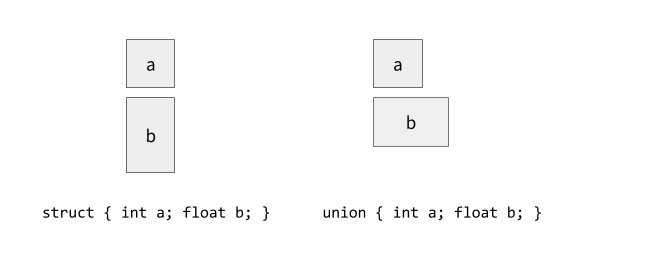

<p class="halfbreak">
</p>

Datatypes
=========

Algebraic data types
--------------------

**Algebraic datatypes** are a family of constructions arising out of two
operations, *products* (``a * b``) and *sums* (``a + b``) (sometimes also called
*coproducts*). A product encodes multiple arguments to constructors and sums
encode choice between constructors.

```haskell
{-# LANGUAGE TypeOperators #-}

data Unit = Unit                 -- 1
data Empty                       -- 0
data (a * b) = Product a b       -- a * b
data (a + b) = Inl a | Inr b     -- a + b
data Exp a b = Exp (a -> b)      -- a^b
data Rec f   = Rec (f (Rec f))   -- \mu
```

The two constructors ``Inl`` and ``Inr`` are the left and right *injections* for
the sum. These allows us to construct sums.

```haskell
Inl :: a -> a + b
Inr :: b -> a + b
```

Likewise for the product there are two function ``fst`` and ``snd`` which are
*projections* which de construct products.

```haskell
fst :: (a,b) -> a
snd :: (a,b) -> b
```

Once a language is endowed with the capacity to write a single product or a
single sum, all higher order products can written in terms of sums of products.
For example a 3-tuple can be written in terms of the composite of two 2-tuples.
And indeed any n-tuple or record type can be written in terms of compositions of
products.

```haskell
type Prod3 a b c = a*(b*c)

data Prod3' a b c
  = Prod3 a b c

prod3 :: Prod3 Int Int Int
prod3 = Product 1 (Product 2 3)
```

Or a sum type of three options can be written in terms of two sums:

```haskell
type Sum3 a b c = (a+b)+c

data Sum3' a b c
  = Opt1 a
  | Opt2 b
  | Opt3 c

sum3 :: Sum3 Int Int Int
sum3 = Inl (Inl 2)
```

```haskell
data Option a = None | Some a
```

```haskell
type Option' a = Unit + a

some :: Unit + a
some = Inl Unit

none :: a -> Unit + a
none a = Inr a
```

In Haskell the convention for the sum and product notation is as follows:

* ``a * b`` : ``(a,b)``
* ``a + b`` : ``Either a b``
* ``Inl``   : ``Left``
* ``Inr``   : ``Right``
* ``Empty`` : ``Void``
* ``Unit`` : ``()``

Recursive Types
---------------


```haskell
roll :: Rec f -> f (Rec f)
roll (Rec f) = f

unroll :: f (Rec f) -> Rec f
unroll f = Rec f
```

$$
\mathtt{Nat} = \mu \alpha. 1 + \alpha
$$

Peano numbers:

```haskell
type Nat = Rec NatF
data NatF s = Zero | Succ s

zero :: Nat
zero = Rec Zero

succ :: Nat -> Nat
succ x = Rec (Succ x)
```

Lists:

```haskell
type List a = Rec (ListF a)
data ListF a b = Nil | Cons a b

nil :: List a
nil = Rec Nil

cons :: a -> List a -> List a
cons x y = Rec (Cons x y)
```

Memory Layout
-------------

Just as the type-level representation 



```cpp
typedef union {
    int a;
    float b;
} Sum;

typedef struct {
    int a;
    float b;
} Prod;
```

```cpp
int main()
{
    Prod x = { .a = 1, .b = 2.0 };
    Sum sum1 = { .a = 1 };
    Sum sum2 = { .b = 1 }; 
}
```

```cpp
#include <stddef.h>

typedef struct T
{
  enum { NONE, SOME } tag;
  union
  {
     void *none;
     int some;
  } value;
} Option;
```

```cpp
int main()
{
    Option a = { .tag = NONE, .value = { .none = NULL } };
    Option b = { .tag = SOME, .value = { .some = 3 } };
}
```

In Haskell:

```haskell
data T
  = Add T T
  | Mul T T
  | Div T T
  | Sub T T
  | Num Int

eval :: T -> Int
eval x = case x of
  Add a b -> eval a + eval b
  Mul a b -> eval a + eval b
  Div a b -> eval a + eval b
  Sub a b -> eval a + eval b
  Num a   -> a
```

In C:

```cpp
typedef struct T {
    enum { ADD, MUL, DIV, SUB, NUM } tag;
    union {
        struct {
            struct T *left, *right;
        } node;
        int value;
    };
} Expr;

int eval(Expr t)
{
    switch (t.tag) {
        case ADD:
            return eval(*t.node.left) + eval(*t.node.right);
            break;
        case MUL:
            return eval(*t.node.left) * eval(*t.node.right);
            break;
        case DIV:
            return eval(*t.node.left) / eval(*t.node.right);
            break;
        case SUB:
            return eval(*t.node.left) - eval(*t.node.right);
            break;
        case NUM:
            return t.value;
            break;
    }
}
```

Syntax
------

GHC.Generics
------------

```haskell
class Generic a where
  type family Rep a :: * -> *
  to   :: a -> Rep a x
  from :: Rep a x -> a
```

Constructor  Models
-----------  -------
``V1``       Void: used for datatypes without constructors
``U1``       Unit: used for constructors without arguments
``K1``       Constants, additional parameters.
``:*:``      Products: encode multiple arguments to constructors
``:+:``      Sums: encode choice between constructors
``L1``       Left hand side of a sum.
``R1``       Right hand side of a sum.
``M1``       Meta-information (constructor names, etc.)

```haskell
newtype M1 i c f p = M1 (f p)
newtype K1 i c   p = K1 c
data U           p = U
```

```haskell
data (:*:) a b p = a p :*: b p
data (:+:) a b p = L1 (a p) | R1 (b p)
```

Full Source
-----------

\clearpage
