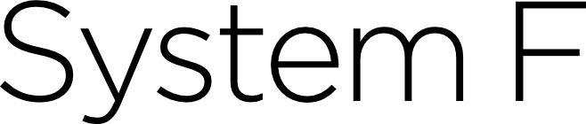

<div class="pagetitle">

</div>

<p class="halfbreak">
</p>

> *Conventional programming languages are growing ever more enormous, but not
> stronger. Inherent defects at the most basic level cause them to be both fat
> and weak...*
> 
> <cite>— John Backus</cite>

<p class="halfbreak">
</p>

System F
========

The *second order lambda calculus* or System F of Girard and Reynolds is an
extension of the simply typed lambda calculus that adds an additional level of
lambda abstraction and type application.

$$
\begin{aligned}
\tau ::=\ & \tau \to \tau \\
          & \alpha \\
          & \forall \overline \alpha . \tau  \\
\end{aligned}
$$

$$
\begin{aligned}
e ::=\ & x \\
       & \lambda x:\tau . e \\
       & \Lambda \alpha . e \\
       & e\ e \\
       & e\ \tau \\
\end{aligned}
$$

$$
\begin{aligned}
\Gamma ::=\ & \varnothing \\
            & \Gamma,\  x : \tau  \\
            & \Gamma,\  \alpha  \\
\end{aligned}
$$

Examples
--------

In GHC Core's language the identity function is implemented precisely in this
form, with the only exception being that it uses the backslash for both the
value-level and type-level lambda. The distinction is that that a $\Lambda$ is
parameterized by a type variable (indicated by ``@ t``) while a $\lambda$ is
parameterized over value variable.

```haskell
\ (@ t) (x :: t) -> x
```

So for some examples:

**Identity function**:

In System F notation:

$$
\begin{aligned}
\mathtt{id}\ & ::\ \forall \alpha. \alpha \to \alpha \\
\mathtt{id}\ & =\ \Lambda \alpha. \lambda x : \alpha. x
\end{aligned}
$$

In GHC Core Notation:

```haskell
id :: forall a. a -> a
id = \ (@ a) (x :: a) -> x
```

**Compose function**:

In System F notation:

$$
\begin{aligned}
\mathtt{compose}\ & ::\ \forall \alpha \beta \gamma. (\beta \to \gamma) \to (\alpha \to \beta) \to \alpha \to \gamma \\
\mathtt{compose}\ & =\ 
  \Lambda \alpha \beta \gamma.\
  \ \lambda \ (f: \beta \to \gamma)
          \ (g: \alpha \to \beta)
          \ (x: \alpha).
          \ f (g\ x)
\end{aligned}
$$

In GHC Core Notation:

```haskell
compose :: forall a b c. (b -> c) -> (a -> b) -> a -> c
compose = 
  \ (@ b) (@ c) (@ a)
    (f :: b -> c) (g :: a -> b) (x :: a)
    -> f (g x)
```

Datatypes
---------

Previously when working with our Hindley-Milner type system we've had to "bolt
on" the primitive datatypes into the language itself. Now in System F primitive
datatypes are actually definable.

$$ \t{Pair} \ u \ v = \Lambda X . \lambda x^{U \rightarrow V \rightarrow X} . x u v $$

Rules
-----

$$
\begin{array}{cl}
 \infrule{x:\tau \in \Gamma}{\Gamma \vdash x:\tau} & \trule{T-Var} \\ \\
 \infrule{\Gamma, x : \tau_1 \vdash e : \tau_2}{\Gamma \vdash \lambda x . \tau_2 : e_1 \rightarrow e_2 } & \trule{T-Lam} \\ \\
 \infrule{\Gamma \vdash e_1 : \tau_1 \rightarrow \tau_2 \andalso \Gamma \vdash e_2 : \tau_1}{\Gamma \vdash e_1 e_2 : \tau_2} & \trule{T-App} \\ \\
 \infrule{\Gamma, \alpha \vdash x : \tau}{\Gamma \vdash \Lambda \alpha. x : \forall \alpha. \tau } & \trule{T-TAbs} \\ \\
 \infrule{\Gamma, \alpha \vdash x : \forall \alpha. \tau_1}{\Gamma \vdash x\ \tau_2 : [\alpha / \tau_2] \tau_2} & \trule{T-TApp} \\ \\
\end{array}
$$


Prenex Restriction
------------------

System F is strictly more general than our previous Hindley-Milner type system,
in the sense that every term can be expressed in System F. Implicitly though
we've made an assumption about the position of qualifiers can only occur at the
front of the type signature in the *prenex position*.  So under this restriction
we can't write a function which takes a polymorphic function as an argument or
returns a polymorphic function as a result. 

Normally when Haskell's typechecker infers a type signature it places all
quantifiers of type variables at the outermost position such that that no
quantifiers appear within the body of the type expression, called the prenex
restriction This restrict an entire class of type signatures that are would
otherwise expressible within System F, but has the benefit of making inference
tractable.

```haskell
-- Allowed
a :: forall a. (a -> a) -> a -> a
a f x = f x

-- Forbidden
a :: (forall a. a -> a) -> b -> b
a f x = f x

-- Forbidden
a :: a -> (forall b. b -> b)
a x = (\x -> x)

-- Forbidden
a :: (forall a. a -> a) -> (forall b. b -> b)
a x = x
```

The concept of *polymorphism rank* falls out of this notion. Simply put the
level of nesting for the qualifier inside the type specifies the rank of the
type signature.

* Rank 0: ``t``
* Rank 1: ``forall a. a -> t``
* Rank 2: ``(forall a. a -> t) -> t``
* Rank 3: ``((forall a. a -> t) -> t) -> t``

The term *rank-n polymorphism* indicates the type systems polymorphism of any
arbitrary rank, allow the qualifier to appear anywhere exposing the entire
expressible space of System F types.

In GHC's implementation a lambda-bound or case-bound variable the user must
provide an explicit annotation or GHC's type inference will assume that the type
has no ``forall``'s in it and must have a principal Rank-1 type which may not
exist.

```haskell
{-# LANGUAGE RankNTypes #-}

-- No annotation: cannot unify Bool with Char
example1 f = (f True, f 'c')

-- Type checks!
example2 :: (forall a. a -> a) -> (Bool, Char)
example2 f = (f True, f 'c')
```

The language extension ``-XRankNTypes`` loosens the prenex restriction such that
we may explicitly place quantifiers within the body of the type. The bad news is
that the general problem of inference in this relaxed system is undecidable in
general, so we're required to explicitly annotate functions which use
``RankNTypes`` or they are otherwise inferred as rank-1 and may not typecheck at
all.

As noted before to fully implement the dictionaries for monad typeclasses we
will need at least rank-2 polymorphism so that the functions specified in the
``DMonad m`` can be instantiated at arbitrary types for ``a`` and ``b``.

```haskell
{-# LANGUAGE RankNTypes #-}

data DMonad m = DMonad
  { return :: forall a. a -> m a
  , bind   :: forall a b. m a -> (a -> m b) -> m b
  }

data Maybe a = Nothing | Just a

bindMaybe :: Maybe a -> (a -> Maybe b) -> Maybe b
bindMaybe (Just x) f = f x
bindMaybe Nothing f = Nothing

returnMaybe :: a -> Maybe a
returnMaybe x = Just x

-- Maybe monad explicit dictionary.
maybe :: DMonad Maybe
maybe = DMonad
  { bind   = bindMaybe
  , return = returnMaybe
  }
```

Type Variables
--------------

Categories of types

* Rho-types $\sigma$
* Polytypes $\rho$
* Monotypes $\tau$

Categories of type variables

* Meta type variables: $\tau_1, \tau_2$
* Bound type variables: $a, b$
* Skolem type variables

Substitution
------------

Erasure
-------

The type erasure:

$$
\begin{aligned}[lcl]
& \t{erase}(x)      &=&\ x \\
& \t{erase}(e_1\ e_2)  &=&\ \t{erase}(e_1)\ \t{erase}(e_2) \\
& \t{erase}(\lambda x:t.e) &=&\ \lambda x . \t{erase}(e) \\
& \t{erase}(\Lambda \alpha . e) &=&\ \t{erase}(e) \\
& \t{erase}(e\ t)    &=&\ \t{erase}(e) \\
\end{aligned}
$$

Evaluation
----------

unbound-generics
----------------

Up until now we've been writing our own binding implementation. There is however
a better way

\clearpage
