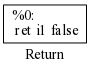
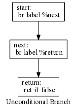
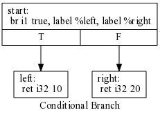
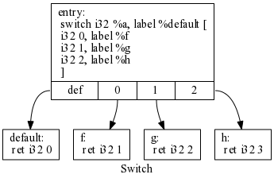
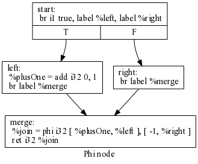
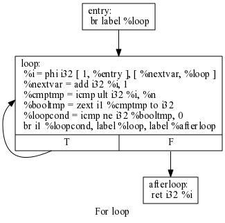

<div class="pagetitle">

</div>

<p class="halfbreak">
</p>

<!--
> *Conventional programming languages are growing ever more enormous, but not
> stronger. Inherent defects at the most basic level cause them to be both fat
> and weak...*
> 
> <cite>— John Backus</cite>
-->

<p class="halfbreak">
</p>


LLVM
====

LLVM is a statically typed intermediate representation and an associated
toolchain for manipulating, optimizing and converting this intermediate form
into native code.

So for example consider a simple function which takes two arguments, adds them,
and xors the result. Writing in IR it would be formed as such:

~~~~ {.haskell include="chapter27/example.ll"}
~~~~

Running this through the LLVM toolchain we can target our high level IR into
multiple different assembly codes mapping onto various architectures and CPUs
all from the same platform agnostic intermediate representation.

**x86-64**

```perl
test1:
        .cfi_startproc
        andl    %edx, %esi
        andl    %edx, %edi
        xorl    %esi, %edi
        movl    %edi, %eax
        ret
```

**ARM**

```perl
test1:
        and     r1, r2, r1
        and     r0, r2, r0
        eor     r0, r0, r1
        mov     pc, lr
```

**PowerPC**

```perl
.L.test1:
        .cfi_startproc
        and 4, 5, 4
        and 3, 5, 3
        xor 3, 3, 4
        blr 
        .long   0
        .quad   0
```

A uncommonly large amount of hardware manufacturers and software vendors (Adobe,
AMD, Apple, ARM, Google, IBM, Intel, Mozilla, Qualcomm, Samsung, Xilinx) have
come have converged on the LLVM toolchain as service agnostic way to talk about
generating machine code.

What's even more impressive is that many of the advances in compiler
optimizations and static analysis have been mechanized in the form of
optimization passes so that all compilers written on top of the LLVM platform
can take advantage of the same advanced optimizers that would often previously
have to be developed independently.

Types
-----

**Primitive**

```perl
i1     ; Boolean type
i8     ; char
i32    ; 32 bit integer
i64    ; 64 bit integer
float  ; 32 bit
double ; 64 bit
```

**Arrays**

```perl
[10 x float]      ; Array of 10 floats
[10 x [20 x i32]] ; Array of 10 arrays of 20 integers.
```

**Structs**

```perl
{float, i64}           ; structure
{float, {double, i3}}  ; nested structure
<{float, [2 x i3]}>    ; packed structure
```

**Vectors**

```perl
<4 x double>
<8 x float>
```

**Pointers**

```perl
float*        ; Pointer to a float
[25 x float]* ; Pointer to an array
```

The traditional ``void*`` pointer in C is a ``i8*`` pointer in LLVM with the
appropriate casts.

**Constants**

```perl
[i1 true, i1 false]    ; constant bool array
<i32 42, i32 10>       ; constant vector
float 1.23421e+2       ; floating point constant
null                   ; null pointer constant
```

The ``zeroinitializer`` can be used to instantiate any type to the appropriate
zero of any type.

```perl
<8 x float> zeroinitializer ; Zero vector
```

**Named Types**

```perl
%vec4 = type <4 x i32>
%pair = type { i32, i32 }
```

Recursive types declarations are supported.

```perl
%f = type { %f*, i32 }
```

**Platform Information**


```perl
target datalayout = "
   e-
   p      : 64  : 64   : 64-
   i1     : 8   : 8-
   i8     : 8   : 8-
   i16    : 16  : 16-
   i32    : 32  : 32-
   i64    : 64  : 64-
   f32    : 32  : 32-
   f64    : 64  : 64-
   v64    : 64  : 64-
   v128   : 128 : 128-
   a0     : 0   : 64-
   s0     : 64  : 64-
   f80    : 128 : 128-
   n8     : 16  : 32   : 64-
   S128
   "
target triple = "x86_64-unknown-linux-gnu"
```

Specifications are delimited by the minus sign ``-``.

* The ``e`` indicates the platform is little-endian.
* The ``i<n>`` indicate the bitsize and alignment of the integer type.
* The ``f<n>`` indicate the bitsize and alignment of the floating point type. 
* The ``p<n>`` indicate the bitsize and alignment of the pointer type.
* The ``v<n>`` indicate the bitsize and alignment of the vector type. 
* The ``a<n>`` indicate the bitsize and alignment of the aggregate type. 
* The ``n<n>`` indicate the widths of the CPU registers.
* The ``S<n>`` indicate the alignment of the stack.

Variables
---------

Symbols used in an LLVM module are either global or local. Global symbols begin
with ``@`` and local symbols begin with ``%``. All symbols must be defined or
forward declared.

Instructions in LLVM are either numbered sequentially (``%0``, ``%1``, ...) or
given explicit variable names (``%a``, ``%foo``, ..). For example the arguments
to the following function are named values, while the result of the add
instructions unnamed.

```perl
define i32 @add(i32 %a, i32 %b) {
  %1 = add i32 %a, %b
  ret i32 %1
}
```

Instructions
------------

```perl
%result = add i32 10, 20
```

**Logical**

* ``shl``
* ``lshr``
* ``ashr``
* ``and``
* ``or``
* ``xor``

**Binary Operators**

* ``add``
* ``fadd``
* ``sub``
* ``fsub``
* ``mul``
* ``fmul``
* ``udiv``
* ``sdiv``
* ``fdiv``
* ``urem``
* ``srem``
* ``frem``

**Comparison**

op  unsigned  signed   floating
--  --------- -------- --------
lt  ULT       SLT      OLT
gt  UGT       SGT      OGT
le  ULE       SLE      OLE
ge  UGE       SGE      OGE
eq  EQ        EQ       OEQ
ne  NE        NE       ONE

```perl
%c = udiv i32 %a, %b
%d = sdiv i32 %a, %b
%e = fmul float %a, %b
%f = fdiv float %a, %b
```

```perl
%g = icmp eq i32 %a, %b
%i = icmp slt i32 %a, %b
%j = icmp ult i32 %a, %b
%k = fcmp olt float, %a, %b
```

Data
----

```perl
i1 1
i32 299792458
float 7.29735257e-3
double 6.62606957e-34
```

Blocks
------

Function definitions in LLVM introduce a sequence of labeled *basic blocks*
containing any number of instructions and a final *terminator* instruction which
indicates how control flow yields after the instructions of the basic block are
evaluated.

```perl
define i1 @foo() {
entry:
  br label %next
next:
  br label %return
return:
  ret i1 0
}
```

A basic block has either zero (for entry block) or a fixed number of
*predecessors*. A graph with basic blocks as nodes and the predecessors of each
basic block as edges constitutes a *control flow graph*. LLVM's opt command can
be used to dump this graph using graphviz.

```bash
$ opt -view-cfg module.ll 
$ dot -Tpng module.dot -o module.png
```

We say a basic block A *dominates* a different block B in the control flow
graph if it's impossible to reach B without passing through "A, equivalently
A is the *dominator* of B.

All logic in LLVM is written in *static single assignment* (SSA) form. Each
variable is assigned precisely once, and every variable is defined before it is
used. Updating any existing variable reference creates a new reference with for
the resulting output.

Control Flow
------------

* Unconditional Branch
* Conditional Branch
* Switch
* Return
* Phi

\clearpage

**Return**

The ``ret`` function simply exits the current function yielding the current
value to the virtual stack.

```perl
define i1 @foo() {
  ret i1 0
}
```



\clearpage

**Unconditional Branch**

The unconditional branch ``br`` simply jumps to any basic block local to the
function.

```perl
define i1 @foo() {
  entry:
    br label %next
  next:
    br label %return
  return:
    ret i1 0
}
```



\clearpage

**Conditional Branch**

The conditional branch ``br`` jumps to one of two basic blocks based on whether
a test condition is ``true`` or ``false``. This corresponds the logic of a
traditional "if statement".

```perl
define i32 @foo() {
start:
  br i1 true, label %left, label %right
left:
  ret i32 10
right:
  ret i32 20
}
```



\clearpage

**Switch**

The switch statement ``switch`` jumps to any number of branches based on the
equality of value to a jump table matching values to basic blocks.

```perl
define i32 @foo(i32 %a) {
entry:
  switch i32 %a, label %default [
    i32 0, label %f
    i32 1, label %g
    i32 2, label %h
  ]
f:
  ret i32 1
g:
  ret i32 2
h:
  ret i32 3
default:
  ret i32 0
}
```



\clearpage

**Phi**

A ``phi`` node selects a value based on the predecessor of the current block.

```perl
define i32 @foo() {
start:
  br i1 true, label %left, label %right
left:
  %plusOne = add i32 0, 1
  br label %merge
right:
  br label %merge
merge:
  %join = phi i32 [ %plusOne, %left ], [ -1, %right ]
  ret i32 %join
}
```



\clearpage

**Loops**

The traditional ``while`` and ``for`` loops can be written in terms of the
simpler conditional branching constructrs. For example in C we would write:

```cpp
int count(int n) 
{
  int i = 0;
  while(i < n) 
  {
    i++;
  }
  return i;
}
```

Whereas in LLVM we write:

```perl
define i32 @count(i32 %n) {
entry:
   br label %loop

loop:
   %i = phi i32 [ 1, %entry ], [ %nextvar, %loop ]
   %nextvar = add i32 %i, 1

   %cmptmp = icmp ult i32 %i, %n
   %booltmp = zext i1 %cmptmp to i32
   %loopcond = icmp ne i32 %booltmp, 0

   br i1 %loopcond, label %loop, label %afterloop

afterloop:
   ret i32 %i
}
```



\clearpage

**Select**

Selects the first value if the test value is true, the second if false.

```perl
%x = select i1 true, i8 10, i8 20   ; gives 10
%y = select i1 false, i8 10, i8 20  ; gives 20
```

Calls
-----

* ``ccc``: The C calling convention
* ``fastcc``: The fast calling convention

```perl
%result = call i32 @exp(i32 7)
```

Memory
------

LLVM uses the traditional load/store model:

* ``load``: Load a typed value from a given reference
* ``store``: Store a typed value in a given reference
* ``alloca``: Allocate a pointer to memory on the virtual stack

```perl
%ptr = alloca i32
store i32 3, i32* %ptr
%val = load i32* %ptr
```

Specific pointer alignment can be specified:

```perl
%ptr = alloca i32, align 1024
```

For allocating in main memory we use an external reference to the C stdlib
memory allocator which gives us back a (``i8*``).

```haskell
%ptr = call i8* @malloc(i32 %objectsize)
```

For structures:

```perl
extractvalue {i32, float} %a, 0              ; gives i32
extractvalue {i32, {float, double}} %a, 0, 1 ; gives double
extractvalue [2 x i32] %a, 0                 ; yields i32
```

```perl
%x = insertvalue {i32, float} %b, float %val, 1         ; gives {i32 1, float %b}
%y = insertvalue {i32, float} zeroinitializer, i32 1, 0 ; gives {i32 1, float 0}
```

GetElementPtr
-------------

Casts
-----

* ``trunc``
* ``zext``
* ``sext``
* ``fptoui``
* ``fptosi``
* ``uitofp``
* ``sitofp``
* ``fptrunc``
* ``fpext``
* ``ptrtoint``
* ``inttoptr``
* ``bitcast``

```haskell
trunc i32 257 to i8         ; yields i8  1
zext i32 257 to i64         ; yields i64 257
sext i8 -1 to i16           ; yields i16 65535
bitcast <2 x i32> %a to i64 ; yields i64 %a
```

Toolchain
---------

```bash
$ llc example.ll -o example.s             # compile
$ lli example.ll                          # execute
$ opt -S example.bc -o example.ll         # to assembly
$ opt example.ll -o example.bc            # to bitcode
$ opt -O3 example.ll -o example.opt.ll -S # run optimizer
```

Individual modules can be linked together.

```bash
$ llvm-link a.ll b.ll -o c.ll -S
```

Link time optimization.

```bash
$ clang -O4 -emit-llvm a.c -c -o a.bc 
$ clang -O4 -emit-llvm a.c -c -o a.bc 
$ llvm-link a.bc b.bc -o all.bc
$ opt -std-compile-opts -std-link-opts -O3 all.bc -o optimized.bc
```

The clang project is a C compiler that targets LLVM as it's intermediate
representation. In the case where we'd like to know how some specific C
construct maps into LLVM IR we can ask clang to dump its internal IR using the
``-emit-llvm`` flag.

```perl
# clang -emit-llvm -S add.c -o -
int add(int x)
{
  return x+1;
}
```

```perl
; ModuleID = 'add.c'
define i32 @add(i32 %x) nounwind uwtable {
entry:
  %x.addr = alloca i32, align 4
  store i32 %x, i32* %x.addr, align 4
  %0 = load i32* %x.addr, align 4
  %add = add nsw i32 %0, 1
  ret i32 %add
}
```

LLVM is using a C++ API underneath the hood of all these tools. If you need to
work directly with the API it can be useful to be able to expand out the LLVM IR
into the equivalent C++ code.

```bash
$ llc example.ll -march=cpp -o -
```

~~~~ {.haskell include="chapter27/example.ll"}
~~~~

```cpp
Function* func_test1 = mod->getFunction("test1");
if (!func_test1) {
func_test1 = Function::Create(
 /*Type=*/FuncTy_0,
 /*Linkage=*/GlobalValue::ExternalLinkage,
 /*Name=*/"test1", mod); 
func_test1->setCallingConv(CallingConv::C);
}
AttrListPtr func_test1_PAL;
func_test1->setAttributes(func_test1_PAL);

{
 Function::arg_iterator args = func_test1->arg_begin();
 Value* int32_x = args++;
 int32_x->setName("x");
 Value* int32_y = args++;
 int32_y->setName("y");
 Value* int32_z = args++;
 int32_z->setName("z");
 
 BasicBlock* label_1 = BasicBlock::Create(mod->getContext(), "",func_test1,0);
 
 BinaryOperator* int32_a = BinaryOperator::Create(
   Instruction::And, int32_z, int32_x, "a", label_1);
 BinaryOperator* int32_b = BinaryOperator::Create(
   Instruction::And, int32_z, int32_y, "b", label_1);
 BinaryOperator* int32_c = BinaryOperator::Create(
   Instruction::Xor, int32_a, int32_b, "c", label_1);
 ReturnInst::Create(mod->getContext(), int32_c, label_1);
 
}
```

llvm-general
------------

The LLVM bindings for Haskell are split across two packages:

* **llvm-general-pure** is a pure Haskell representation of the LLVM IR.

* **llvm-general** is the FFI bindings to LLVM required for constructing the C representation of the
  LLVM IR and performing optimization and compilation.

llvm-general-pure does not require the LLVM libraries be available on the system.

GHCi can have issues with the FFI and can lead to errors when working with
``llvm-general``.  If you end up with errors like the following, then you are
likely trying to use ``GHCi`` or ``runhaskell`` and it is unable to link against
your LLVM library. Instead compile with standalone ``ghc``.

```bash
Loading package llvm-general-3.3.8.2 
... linking 
... ghc: /usr/lib/llvm-3.3/lib/libLLVMSupport.a: unknown symbol `_ZTVN4llvm14error_categoryE'
ghc: unable to load package `llvm-general-3.3.8.2'
````

Code Generation (LLVM)
======================

Resources
---------

* [LLVM Language Reference](http://llvm.org/docs/LangRef.html)
* [Implementing a JIT Compiled Language with Haskell and LLVM](http://www.stephendiehl.com/llvm/)

\clearpage
