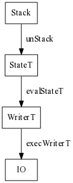

~~~~ {literal="latex_macros"}
~~~~


******

<!--
<blockquote>
An elegant weapon for a more civilized age.
<cite>Obi-Wan Kenobi</cite>
</blockquote>
-->

<p class="halfbreak">
</p>

Haskell Basics
==============

Let us now survey a few of the core concepts that will be used throughout the
text. This will be a very fast and informal discussion.  If you are familiar
with all of these concepts then it is very likely you will be able to read the
entirety of this tutorial and focus on the subject domain and not the supporting
code. The domain material itself should largely be accessible to an ambitious
high school student or undergraduate; and requires nothing more than a general
knowledge of functional programming.

Functions
---------

Functions are the primary building block of all of Haskell logic.

```haskell
add :: Integer -> Integer -> Integer
add x y =  x + y
```

```haskell
add (x,y) = x + y
```

In Haskell all functions are pure, the only thing a function may do is return a value.

All functions in Haskell are curried, for example a function of three arguments takes up to three arguments and for
anything less than three it yields a partially applied function which when given additional arguments yields a
another function or the resulting value if saturated.

```haskell
g :: Int -> Int -> Int -> Int
g x y z = x + y + z

h :: Int -> Int
h = g 2 3 
```

Haskell supports higher-order functions, functions which take functions and yield other functions.

```haskell
compose f g = \x -> f (g x)
```

```haskell
iterate :: (a -> a) -> a -> [a]
iterate f x = x : (iterate f (f x))
```

Datatypes
---------

Constructors for datatypes come in two flavors, *sum types* and *product types*.

A sum type consists of multiple options of *type constructors* under the same
type. The two cases can be used at all locations the type is specified, and are
discriminated using pattern matching.

```haskell
data Sum = A Int | B Bool
```

A product type combines multiple typed fields into the same type.

```haskell
data Prod = Prod Int Bool
```

Records are a special product type that in addition to generating code for the
constructors also generates special set of functions known as *selectors* which
extract the values of a specific field from the record.

```haskell
data Prod = Prod 
  { a :: Int
  , b :: Bool
  }

-- a :: Prod -> Int
-- b :: Prod -> Bool
```

Sums and products can be combined to produce combinations thereof.

```haskell
data T1 
  = A Int Int
  | B Bool Bool
```

The fields of a datatype may be a *parameterized* in which case the type depends
on the specific types the fields are instantiated with.

```haskell
data Maybe a = Nothing | Just a
```

Values
------

A list is an homogeneously inductively defined sum type of linked cells parameterized over the type of its
values.

```haskell
data List a = Nil | Cons a (List a)
```

```haskell
a = [1,2,3]
a = Cons 1 (Cons 2 (Cons 3 Nil))
```

List have special value-level syntax:

```haskell
(:) = Cons
[]  = Nil
```

```haskell
(1 : (2 : (3 : []))) = [1,2,3]
```

A tuple is a heterogeneous product type parameterized over the types of its two values.

Tuples also have special value-level syntax.

```haskell
data Pair a b = Pair a b
```

```haskell
a = (1,2)
a = Pair 1 2
```

```haskell
(,) = Pair
```

Tuples are allowed (with compiler support) up to 15 fields in GHC.

Pattern matching
----------------

Pattern matching allows us to discriminate on the constructor(s) of a datatype,
mapping separate cases to separate code paths.

```haskell
data Either a b = Left a | Right b

maybe :: b -> (a -> b) -> Maybe a -> b
maybe n f Nothing  = n
maybe n f (Just a) = f a
```

Toplevel pattern matches can always be written identically as case statements.

```haskell
maybe :: b -> (a -> b) -> Maybe a -> b
maybe n f x = case x of
  Nothing -> n
  Just a  -> f a
```

Wildcards can be placed for patterns where the resulting value is not used.

```haskell
const :: a -> b -> a
const x _ = x
```

List and tuples have special pattern syntax.

```haskell
length :: [a] -> Int
length []     = 0
length (x:xs) = 1 + (length xs)
```

```haskell
fst :: (a, b) -> a
fst (a,b) = a
```

Patterns may be guarded by predicates ( functions which yield a boolean ) which guard against entering the
branch of pattern matching unless the predicate holds.

```haskell
filter :: (a -> Bool) -> [a] -> [a]
filter pred []     = []
filter pred (x:xs)
  | pred x         = x : filter pred xs
  | otherwise      =     filter pred xs

```

Recursion
---------

In Haskell all iteration over data structures is performed by recursion.
Entering a function in Haskell does not create a new stack frame, the logic of
the function is simply entered with the arguments on the stack and yields result
to the register. The resulting logic is compiled identically to ``while`` loops
in other languages, via a ``jmp`` instruction instead of a ``call``.

```haskell
factorial 0 = 1
factorial n = n * factorial (n - 1)
```

Functions can be defined to recurse mutually on each other.

```haskell
even 0 = True
even n = odd (n-1)

odd 0 = False
odd n = even (n-1)
```

Laziness
--------

A Haskell program can be thought as being equivalent to a large directed graph.
Each edge represents a use of a value, and each node is a source of a value. A
node can be:

* A *thunk*, the application of a function to values that has not be evaluated
  yet.
* A thunk that is currently being evaluated, which may induce the evaluation of
  other thunks in the process.
* A value in *weak head normal form*, a builtin type or constructor that has
  been evaluated. For constructors it is evaluated at least to the outermost
  constructor.

The runtime has the task of determining which thunks are to be evaluated by the
order in which they are connected to the main function node, this is the essence
of all evaluation in Haskell and is called *graph reduction*. 

For example, the following self-referential functions are allowed
in Haskell and generate infinite lists of values which are only evaluated up
to the depth that it is needed.

```haskell
ones = 1 : ones
```

```haskell
numsFrom n = n : numsFrom (n+1)
```

```haskell
squares = map (^2) (numsfrom 0)
```

```haskell
take 5 squares
```

This also admits diverging terms, called *bottoms* which have no normal form.
What is unique about Haskell is that these values can be threaded around and
don't diverge unless actually used.

```haskell
bot = bot
```

So for instance the following expression does not diverge since the second
argument is not used in the body of ``const``.

```haskell
const 42 bot
```

Higher Kinded Types
-------------------

The "type of types" in Haskell is the language of kinds. Kinds are either a
arrow (``* -> *``) or a star (``*``).


The kind of an Int is ``*`` while the kind of ``Maybe``  is ``* -> *``. Haskell
supports higher kinded types which are types which themselves take types to
other types. A type constructor in Haskell always has a kind which terminates in
a ``*``.

```haskell
-- T1 :: (* -> *) -> * -> *
data T1 f a = T1 (f a)
```

The three special types ``(,)``, ``(->)``, ``[]`` have special type-level
syntactic sugar:

```haskell
(,) Int Int   =  (Int, Int)
(->) Int Int  =  Int -> Int
[] Int        =  [Int]
```

Typeclasses
-----------

A typeclass is a collection of functions which conform to a given interface.  An implementation of the
interface is called an instance. Typeclasses are effectively syntactic sugar for records of functions and
nested records ( called *dictionaries* ) of functions parameterized over the instance type.  These
dictionaries are implicitly threaded throughout the program whenever an overloaded identifier is used. When a
typeclass is used over a concrete type the implementation is simply spliced in at the call site. When a
typeclass is used over an polymorphic type an implicit dictionary parameter is added to the function so that
the implementation of the necessary functionality is passed with the polymorphic value.

Typeclass are "open" and additional instances can always be added, but the defining feature of a typeclass is
that the instance search always converges to a single type to make the process of resolving overloaded identifiers
globally unambiguous.

For instance the Functor typeclass allows us to "map" a function generically over any type of kind (``* ->
*``) applying it on its internal structure.

```haskell
class Functor f where
  fmap :: (a -> b) -> f a -> f b

instance Functor [] where
  fmap f []     = []
  fmap f (x:xs) = f x : fmap f xs

instance Functor ((,) a) where
  fmap f (a,b) = (a, f b)
```

Operators
---------

In Haskell infix operators are simply functions, and quite often they are used in
place of alphanumerical names when the functions involved combine in common ways
and are subject to algebraic laws.

```haskell
infixl 6 +
infixl 6 -
infixl 7 /
infixl 7 *

infixr 5 ++
infixr 9 .
```

Operators can be written in section form:

```haskell
(x+) =	\y -> x+y
(+y) =	\x -> x+y
(+)  =	\x y -> x+y
```

Any binary function can be written in infix form by surrounding the name in
backticks.

```haskell
(+1) `fmap` [1,2,3] -- [2,3,4]
```

Monads
------

A monad is a typeclass with two functions ``bind`` and ``return``.

```haskell
class Monad m where
  bind   :: m a -> (a -> m b) -> m b
  return :: a -> m a
```

The bind function is usually written as an infix operator.

```haskell
infixl 1 >>=

class Monad m where
  (>>=)  :: m a -> (a -> m b) -> m b
  return :: a -> m a
```

This defines the structure, but the monad itself also requires three laws that
all monad instances must satisfy.

**Law 1**

```haskell
return a >>= f ≡ f a
```

**Law 2**

```haskell
m >>= return ≡ m
```

**Law 3**

```haskell
(m >>= f) >>= g ≡ m >>= (\x -> f x >>= g)
```

Haskell has a level of syntactic sugar for monads known as do-notation. In this
form binds are written sequentially in block form which extract the variable
from the binder.

```haskell
do { a <- f ; m } ≡ f >>= \a -> do { m }
do { f ; m } ≡ f >> do { m }
do { m } ≡ m
```

So for example the following are equivalent.

```haskell
do
  a <- f
  b <- g
  c <- h
  return (a, b, c)
```

```haskell
f >>= \a ->
  g >>= \b ->
    h >>= \c ->
      return (a, b, c)
```

Applicatives
-------------

Applicatives allow sequencing parts of some contextual computation, but not
binding variables therein. Applicatives are strictly less expressive than
monads.

```haskell
class Functor f => Applicative f where
  pure  :: a -> f a
  (<*>) :: f (a -> b) -> f a -> f b

(<$>) :: Functor f => (a -> b) -> f a -> f b
(<$>) = fmap
```

Together with several laws this defines applicatives.

```haskell
pure id <*> v = v
pure f <*> pure x = pure (f x)
u <*> pure y = pure ($ y) <*> u
u <*> (v <*> w) = pure (.) <*> u <*> v <*> w
```

For example:

```haskell
example1 :: Maybe Integer
example1 = (+) <$> m1 <*> m2
  where
    m1 = Just 3
    m2 = Nothing
```

Applicative also has functions ``*>`` and ``<*`` that sequence applicative
actions while discarding the value of one of the arguments. The operator *>
discards the left while ``<*`` discards the right. For example in a monadic
parser combinator library the ``*>`` would parse with first parser argument but
return the second.

Deriving
--------

Instances for typeclasses like ``Read``, ``Show``, ``Eq`` and ``Ord`` can be derived automatically by the
Haskell compiler.

```haskell
data PlatonicSolid 
  = Tetrahedron
  | Cube
  | Octahedron
  | Dodecahedron
  | Icosahedron
  deriving (Show, Eq, Ord, Read)
```

```haskell
example = show Icosahedron
example = read "Tetrahedron"
example = Cube == Octahedron
example = sort [Cube, Dodecahedron]
```

IO
--

A value of type IO a is a computation which, when performed, does some I/O
before returning a value of type ``a``. The notable feature of Haskell is that
IO is still pure, a value of type ``IO a`` is simply a value which stands for a computation
which when performed would perform IO and there is no way to peek into its
contents without running it.

For instance the following function does not print the numbers 1 to 5 to the screen, it instead builds a list
of IO computations.

```haskell
fmap print [1..5] :: [IO ()]
```

Which we can manipulate just as an ordinary list of values, for instance.

```haskell
reverse (fmap print [1..5]) :: [IO ()]
```

Using ``sequence_`` we can then build a composite computation of each of the IO
actions in the list sequenced in time the same order as the list, the resulting
``IO`` computation can be evaluated in ``main`` or the GHCi repl which
effectively is embedded inside of ``IO``.

```haskell
>> sequence_ (fmap print [1..5]) :: IO ()
1
2
3
4
5

>> sequence_ (reverse (fmap print [1..5])) :: IO ()
5
4
3
2
1
```

The IO monad is a special monad wired into the runtime, it is a degenerate case
and most monads in Haskell have nothing to do with effects in this sense.

```haskell
putStrLn :: String -> IO ()
print    :: Show a => a -> IO ()
```

The type of ``main`` is always ``IO ()``.

```haskell
main :: IO ()
main = do
  putStrLn "Enter a number greater than 3: "
  x <- readLn 
  print (x > 3)
```

The essence of monadic IO in Haskell is that *effects are reified as first class
values in the language and reflected in the type system*. This is one of
foundational ideas of Haskell, although not unique to Haskell.

Monad Transformers
------------------

Monads can be combined together to form composite monads. Each of the composite
monads consists of *layers* of different monad functionality. For example we can
combine a an error reporting monad with a state monad to encapsulate a certain
set of computations that need both functionality. The use of monad transformers,
while not always neccessary, is nevertheless often one of the primary ways to
structure modern Haskell programs.

```haskell
class MonadTrans t where
  lift :: Monad m => m a -> t m a
```

Using the transformers library:

<p class="center">

</p>

The implementation of monad transformers is comprised of two different
complementary libraries, ``transformers`` and ``mtl``. Transformers provides the
base monad transformer layers and ``mtl`` uses a language extension called
functional dependencies to allow implicitly lifting between several layers of a
monad transformer stack without explicit lifts.

Using transformers we simply import the *Trans* variants of each of the layers
we want to compose and then wrap them in a newtype.

```haskell
{-# LANGUAGE GeneralizedNewtypeDeriving #-}

import Control.Monad.Trans
import Control.Monad.Trans.State
import Control.Monad.Trans.Writer

newtype Stack a = Stack { unStack :: StateT Int (WriterT [Int] IO) a }
  deriving (Monad)

foo :: Stack ()
foo = Stack $ do
  put 1                  -- State layer
  lift $ tell [2]        -- Writer layer
  lift $ lift $ print 3  -- IO Layer
  return ()

evalStack :: Stack a -> IO [Int]
evalStack m = execWriterT (evalStateT (unStack m) 0)
```

Using mtl and ``GeneralizedNewtypeDeriving`` we can produce the same stack but with
a simpler forward facing interface to the transformer stack. Under the hood mtl
is using an extension called ``FunctionalDependencies`` to automatically infer
which layer of a transformer stack a function belongs to and can automatically
lift into it.

```haskell
{-# LANGUAGE GeneralizedNewtypeDeriving #-}

import Control.Monad.Trans
import Control.Monad.State
import Control.Monad.Writer

newtype Stack a = Stack { unStack :: StateT Int (WriterT [Int] IO) a }
  deriving (Monad, MonadState Int, MonadWriter [Int], MonadIO)

foo :: Stack ()
foo = do
  put 1             -- State layer
  tell [2]          -- Writer layer
  liftIO $ print 3  -- IO Layer
  return ()

evalStack :: Stack a -> IO [Int]
evalStack m = execWriterT (evalStateT (unStack m) 0)
```

**StateT**

The state monad allows functions within a stateful monadic context to access and
modify shared state.

```haskell
put    :: s -> State s ()          -- set the state value
get    :: State s s                -- get the state
gets   :: (s -> a) -> State s a    -- apply a function over the state, and return the result
modify :: (s -> s) -> State s ()   -- set the state, using a modifier function
```

Evaluation functions often follow a naming convention with ( run, eval, exec ):

```haskell
execState :: State s a -> s -> s         -- yield the state
evalState :: State s a -> s -> a         -- yield the return value
runState  :: State s a -> s -> (a, s)    -- yield the state and return value
```

For example:

```haskell
import Control.Monad.State

test :: State Int Int
test = do
  put 3
  modify (+1)
  get

main :: IO ()
main = print $ execState test 0
```

**ReaderT**

The Reader monad allows a fixed value to be passed around inside the monadic
context. 

```haskell
ask   :: Reader r r                            -- get the value
local :: (r -> r) -> Reader r a -> Reader r a  -- run a monadic action, with the value modified by a function
```

For example:

```haskell
import Control.Monad.Reader

data MyContext = MyContext
  { foo :: String
  , bar :: Int
  } deriving (Show)

computation :: Reader MyContext (Maybe String)
computation = do
  n <- asks bar
  x <- asks foo
  if n > 0
    then return (Just x)
    else return Nothing

ex1 :: Maybe String
ex1 = runReader computation $ MyContext "hello" 1

ex2 :: Maybe String
ex2 = runReader computation $ MyContext "haskell" 0
```

**WriterT**

The writer monad lets us emit a lazy stream of values from within a monadic
context. The primary function ``tell`` adds a value to the writer context.

```haskell
tell :: (Monoid w) => w -> Writer w ()
```

The monad is either devalued with the collected values or without.

```haskell
execWriter :: (Monoid w) => Writer w a -> w
runWriter  :: (Monoid w) => Writer w a -> (a, w)
```

```haskell
import Control.Monad.Writer

type MyWriter = Writer [Int] String

example :: MyWriter
example = do
  tell [1..5]
  tell [5..10]
  return "foo"

output :: (String, [Int])
output = runWriter example
```

**ExceptT**

The Exception monad allows logic to fail at any point during computation with a
user-defined exception. The exception type is the first parameter of the monad
type. 

```haskell
throwError :: e -> Except e a
runExcept  :: Except e a -> Either e a
```
For example:

```haskell
import Control.Monad.Except

type Err = String

safeDiv :: Int -> Int -> Except Err Int
safeDiv a 0 = throwError "Divide by zero"
safeDiv a b = return (a `div` b)

example :: Either Err Int
example = runExcept $ do
  x <- safeDiv 2 3
  y <- safeDiv 2 0
  return (x + y)
```

**Kleisli Arrows**

An additional combinator for monads composes two different monadic actions in
sequence. It is the monadic equivalent of the regular function composition
operator ``(.)``.

```haskell
(>=>) :: Monad m => (a -> m b) -> (b -> m c) -> a -> m c
```

The monad laws can be expressed equivalently in terms of Kleisli composition.

```haskell
(f >=> g) >=> h ≡ f >=> (g >=> h)
return >=> f ≡ f
f >=> return ≡  f
```

Cabal
-----

To set up an existing project with a sandbox invoke:

```bash
$ cabal sandbox init
```

This will create the ``.cabal-sandbox`` directory which is the local path GHC
will use when building the project to look for dependencies.

To install the dependencies from Hackage invoke:

```bash
$ cabal install --only-dependencies
```

Finally configure the library for building: 

```bash
$ cabal configure
```

Now we can launch a GHCi shell scoped with the modules from the project in
scope:

```bash
$ cabal repl
```

Resources
=========

If any of these concepts are unfamiliar, there are some external resources that
will try to explain them. Probably the most thorough is the Standard course
lecture notes.

* [Stanford CS240h](http://www.scs.stanford.edu/14sp-cs240h/)

There are some books as well, your mileage may vary with these. Much of the
material they cover is dated or sometimes typically only covers basic functional
programming and not "programming in the large".

* [Real World Haskell](http://www.amazon.com/Real-World-Haskell-Bryan-OSullivan/dp/05965149800) by Bryan O'Sullivan, Don Stewart, and John Goerzen
* [Programming in Haskell](http://www.amazon.com/gp/product/0521692695) by Graham Hutton
* [Thinking Functionally](http://www.cambridge.org/us/academic/subjects/computer-science/programming-languages-and-applied-logic/thinking-functionally-haskell) by Richard Bird
